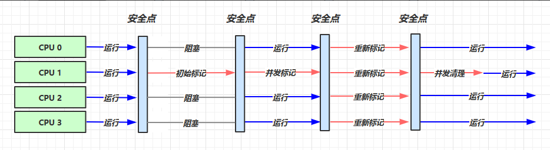

# 垃圾回收
jvm几种垃圾回收算法
<!-- more -->

1. 如何判断对象是否可以回收

   - **引用计数法**  无法处理循环引用
   - **可达性分析算法**
     - 使用可达性分析探索所有存活的对象
     - 扫描堆中的对象，看是否能够沿着GC Root（多个 一系列）对象起点的引用链找到该对象，找不到就回收
     - 些对象可以作为GC Root  （加锁的  线程中的  启动的核心对象  等）
   - 四种引用
     - **强引用** 
       - 只有所有 GC Roots 对象都不通过【强引用】引用该对象，该对象才能被垃圾回收 
     - **软引用**（SoftReference） 
       - 仅有软引用引用该对象时，在垃圾回收后，内存仍不足时会再次出发垃圾回收，回收软引用对象 可以配合引用队列来释放软引用自身 
     - **弱引用**（WeakReference） 
       - 仅有弱引用引用该对象时，在垃圾回收时，无论内存是否充足，都会回收弱引用对象可以配合引用队列来释放弱引用自身 
     - **虚引用**（PhantomReference） 
       - 必须配合引用队列使用，主要配合 ByteBuffer 使用，被引用对象回收时，会将虚引用入队， 由 Reference Handler 线程调用虚引用相关方法释放直接内存 
     - **终结器引用**（FinalReference） 
       - 无需手动编码，但其内部配合引用队列使用，在垃圾回收时，终结器引用入队（被引用对象 暂时没有被回收），再由 Finalizer 线程通过终结器引用找到被引用对象并调用它的 finalize 方法，第二次 GC 时才能回收被引用对象

2. 垃圾回收算法（结合多种算法共同实现）

   1. **标记清除算法** （标记可以释放的内存块 并记录到地址列表里  下次有新的对象则直接用这块地址  而不用清直接清除这块内存  鸠占鹊巢）
      - 速度较快
      - 会造成内存碎片
   2. **标记整理**（需要移动是对象从而进行整理）
      - 速度慢
      - 没内存碎片
   3. **复制** （需要将对象复制到新的空间中）
      - 不会有内存碎片 
      - 需要占用双倍内存空间

3. 分代垃圾回收

   - 对象首先分配在伊甸园区域 

   - 新生代空间不足时，触发 minor gc，伊甸园和 from区 存活的对象使用 copy 复制到 to区 中，存活的 对象年龄加 1并且交换 from和 to （幸存区 to 和  from）

   - minor gc 会引发 stop the world（STW），暂停其它用户的线程，等垃圾回收结束，用户线程才恢复运行 当对象寿命超过阈值时，会晋升至老年代，最大寿命是15（4bit） 

   - 当老年代空间不足，会先尝试触发 minor gc，如果之后空间仍不足，那么触发 full gc，STW的时间更长

   - 相关 VM 参数

     | **含义**           | **参数**                                                     |
     | ------------------ | ------------------------------------------------------------ |
     | 堆初始大小         | -Xms                                                         |
     | 堆最大大小         | -Xmn 或 (-XX:NewSize=size + -XX:MaxNewSize=size )            |
     | 幸存区比例（动态） | -XX:InitialSurvivorRatio=ratio 和 -XX:+UseAdaptiveSizePolicy |
     | 幸存区比例         | -XX:SurvivorRatio=ratio                                      |
     | 晋升阈值           | -XX:MaxTenuringThreshold=threshold                           |
     | 晋升详情           | -XX:+PrintTenuringDistribution                               |
     | GC详情             | -XX:+PrintGCDetails -verbose:gc                              |
     | FullGC前先MinorGC  | -XX:+ScavengeBeforeFullGC                                    |
     |                    |                                                              |

4. 垃圾回收器

   1. 串行单线程 （SerialGC）

      - 堆内存较小，适合个人电脑 
      - -XX:+UseSerialGC = Serial + SerialOld

   2. 吞吐量优先 (ParallelGC)

      - 多线程 

      - 堆内存较大，多核 cpu 

      - 让单位时间内，STW 的时间最短 0.2 0.2 = 0.4，垃圾回收时间占比最低，这样就称吞吐量高 

      - -XX:+UseParallelGC ~ -XX:+UseParallelOldGC 

        -XX:+UseAdaptiveSizePolicy 

        -XX:GCTimeRatio=ratio 

        -XX:MaxGCPauseMillis=ms 

        -XX:ParallelGCThreads=n

   3. 响应时间优先 （CMS 因为使用标记-清除算法 所以会存在垃圾碎片过多时 并发失败  退化为串行垃圾回收  时间反而会更长）

      - 首先初始标记标记根对象（STW）  并发标记标记可达性对象  重新标记标记在刚才并发标记过程中新生成的对象（STW）、随后并发清除（标记-清除）

      ​	

      - 多线程

      - 堆内存较大，多核 cpu 

      - 尽可能让单次 STW 的时间最短 0.1 0.1 0.1 0.1 0.1 = 0.5

      - -XX:+UseConcMarkSweepGC ~ -XX:+UseParNewGC ~ SerialOld 

        -XX:ParallelGCThreads=n ~ -XX:ConcGCThreads=threads 

        -XX:CMSInitiatingOccupancyFraction=percent 

        -XX:+CMSScavengeBeforeRemark

   4. G1 

      - 同时注重吞吐量（Throughput）和低延迟（Low latency），默认的暂停目标是 200 ms 

      - 超大堆内存，会将堆划分为**多个大小相等的** Region 

      - 整体上是 标记+整理 算法，两个区域之间是 复制 算法  

      - -XX:+UseG1GC 

        -XX:G1HeapRegionSize=size 

        -XX:MaxGCPauseMillis=time

      - 过程

        1. 首先进行新生代的垃圾回收Young GC
        2. 在 Young GC 时就会进行 GC Root 的初始标记  当老年代占用堆空间比例达到阈值时（触发条件），会进行并发标记（不会 STW），由下面的 JVM 参数决定-XX:InitiatingHeapOccupancyPercent=percent （默认45%） 
        3. 当并发标记完成后 进行混合收集  会对 新生代、幸存区、老年代 进行全面垃圾回收（会优先回收那些垃圾最多的区域更有行性价比）；最终标记然后因为是并发的  所以在标记的时候会产生新的垃圾  这时候会进行一次最终标记（Remark）会 STW 标记完就行拷贝存活（Evacuation）（就是把没有回收的的幸存对象拷贝到新的堆空间）会 STW

5. 垃圾回收调优

   - 没有固定的调优手法  只有最适合当前场景的调优手段