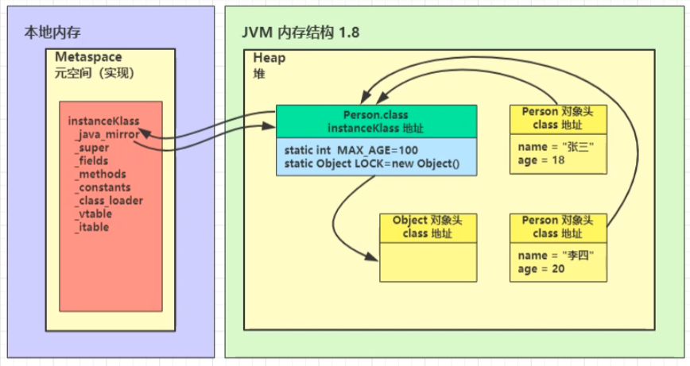

# 类加载与字节码技术
##### 你就是双亲委派？
<!-- more -->

多态执行原理

- 当执行 invokevirtual 指令时， 
  1. 先通过栈帧中的对象引用找到对象 
  2. 分析对象头，找到对象的实际 Class 
  3. Class 结构中有 vtable（虚方法表），它在类加载的链接阶段就已经根据方法的重写规则生成好了 
  4. 查表得到方法的具体地址 
  5. 执行方法的字节码

编译期处理

- 语法糖 ，其实就是指 java 编译器把 *.java 源码编译为 *.class 字节码的过程中，自动生成 和转换的一些代码，主要是为了减轻程序员的负担，算是 java 编译器给我们的一个额外福利（给糖吃 嘛） 注意，编译器转换的结果直接就是 class 字节码，只是为了便于阅读，给出了 几乎等价 的 java 源码方式，并 不是编译器还会转换出中间的 java 源码，切记。

##### 类加载阶段

1. **加载**
   - 将类的字节码载入方法区中，内部采用 C++ 的 instanceKlass 描述 java 类，它的重要 field 有： 
     - java_mirror 即 java 的类镜像，例如对 String 来说，就是 String.class，作用是把 klass 暴 露给 java 使用 
     - _super 即父类 
     - _fields 即成员变量 
     - _methods 即方法 
     - _constants 即常量池 
     - _class_loader 即类加载器 
     - _vtable 虚方法表 
     - _itable 接口方法表 
   - 如果这个类还有父类没有加载，先加载父类   加载和链接可能是交替运行的

2. **链接**
   1. 验证
      - 验证类是否符合 JVM规范，安全性检查 
   2. 准备
      - 为 static 变量分配空间，设置默认值 
      - static 变量在 JDK 7 之前存储于 instanceKlass 末尾，从 JDK 7 开始，存储于 _java_mirror 末尾 
      - static 变量分配空间和赋值是两个步骤，分配空间在准备阶段完成，赋值在初始化阶段完成 
      - 如果 static 变量是 final 的基本类型，以及字符串常量，那么编译阶段值就确定了，赋值在准备阶 段完成 
      - 如果 static 变量是 final 的，但属于引用类型，那么赋值也会在初始化阶段完成
   3. 解析
      - 将常量池中的符号引用解析为直接引用
3. **初始化**
   - cinit()V 方法   初始化即调用 cinit()V ，虚拟机会保证这个类的『构造方法』的线程安全
   - **发生时机** 概括得说，类初始化是【懒惰的】 
     - main 方法所在的类，总会被首先初始化 
     - 首次访问这个类的静态变量或静态方法时 
     - 子类初始化，如果父类还没初始化，会引发 
     - 子类访问父类的静态变量，只会触发父类的初始化 
     - Class.forName 
     - new 会导致初始化 
   - 不会导致类初始化的情况 
     - 访问类的 static final 静态常量（基本类型和字符串）不会触发初始化 
     - 类对象.class 不会触发初始化 
     - 创建该类的数组不会触发初始化 
     - 类加载器的 loadClass 方法 
     - Class.forName 的参数 2 为 false 时

##### 类加载器

| **名称**                                     | **加载哪的类**        | **说明**                      |
| -------------------------------------------- | --------------------- | ----------------------------- |
| Bootstrap ClassLoader （启动类加载器）       | JAVA_HOME/jre/lib     | 无法直接访问                  |
| Extension ClassLoader（拓展类加载器）        | JAVA_HOME/jre/lib/ext | 上级为 Bootstrap，显示为 null |
| Application ClassLoader （应用程序类加载器） | classpath             | 上级为 Extension              |
| 自定义类加载器                               | 自定义                | 上级为 Application            |

1. **双亲委派模式** 

   - 所谓的双亲委派，就是指调用类加载器的 loadClass 方法时，查找类的规则
   - 首先会从应用程序类加载器进行进行加载（缓存）查看是否加载过
   - 如果没有加载过则委派上级（拓展类加载器）查看是否加载过
   - 如果没有则再委派上级（启动类加载器）查看是否加载过
   - 如果还是没有那就通过findClass查找是否有这个类
   - 启动类如果没有  就接着递归的返回 通过拓展类查找是否有这个类
   - 如果拓展类加载器没有  就又回到了应用程序类加载器查找是否有这个类  有即返回

2. 自定义类加载器

   - 问问自己，什么时候需要自定义类加载器 

     1）想加载非 classpath 随意路径中的类文件 

     2）都是通过接口来使用实现，希望解耦时，常用在框架设计 

     3）这些类希望予以隔离，不同应用的同名类都可以加载，不冲突，常见于 tomcat 容器

   - 步骤： 

     1. 继承 ClassLoader 父类 
     2. 要遵从双亲委派机制，重写 findClass 方法 注意不是重写 loadClass 方法，否则不会走双亲委派机制
     3. 读取类文件的字节码 
     4. 调用父类的 defineClass 方法来加载类 
     5. 使用者调用该类加载器的 loadClass 方法

##### 运行时优化

1. JVM 将执行状态分成了 5 个层次： 

   - 0 层，解释执行（Interpreter） 
   - 1 层，使用 C1 即时编译器编译执行（不带 profiling） 
   - 2 层，使用 C1 即时编译器编译执行（带基本的 profiling） 
   - 3 层，使用 C1 即时编译器编译执行（带完全的 profiling） 
   - 4 层，使用 C2 即时编译器编译执行 

   > profiling 是指在运行过程中收集一些程序执行状态的数据，例如【方法的调用次数】，【循环的回边次数】等 

2. 即时编译器（JIT）与解释器的区别

   - 解释器是将字节码解释为机器码，下次即使遇到相同的字节码，仍会执行重复的解释 
   - JIT 是将一些字节码编译为机器码，并存入 Code Cache，下次遇到相同的代码，直接执行，无需再编译 
   - 解释器是将字节码解释为针对所有平台都通用的机器码 
   - JIT 会根据平台类型，生成平台特定的机器码

   对于占据大部分的不常用的代码，我们无需耗费时间将其编译成机器码，而是采取解释执行的方式运行；另一方面，对于仅占据小部分的热点代码，我们则可以将其编译成机器码，以达到理想的运行速度。执行效率上简单比较一下 Interpreter < C1 < C2，总的目标是发现热点代码（hotspot名称的由来），优化之

   **逃逸分析**：就判断对象或者方法会不会被别人使用  如果不会被别人使用则通过JIT   C2进行字节码替换不在创建对象 

   **锁消除**：当JIT编译器通过逃逸分析（Escape Analysis）确定某个对象的锁仅在当前线程内使用（即对象不会逃逸到其他线程）时，它会判定该锁是冗余的。此时，JIT会直接移除同步代码块（如synchronized）的加锁/解锁操作，从而避免线程竞争检查、内核态切换等开销。

3. 方法内联

   1. 如果发现 square 是热点方法，并且长度不太长时，会进行内联，所谓的内联就是把方法内代码拷贝、 粘贴到调用者的位置。