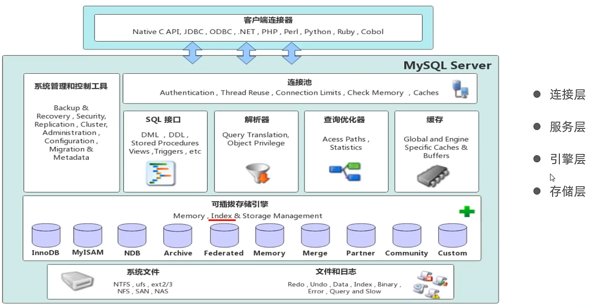
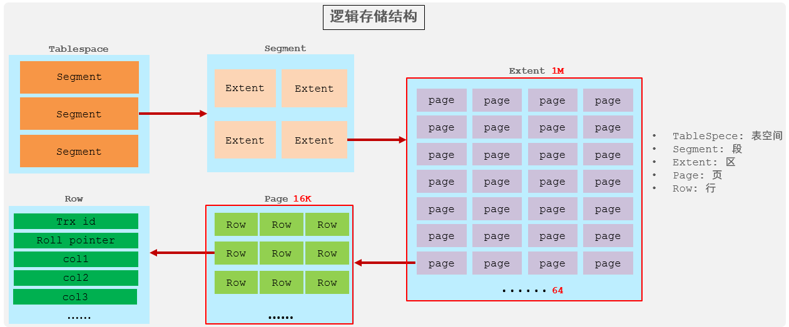

---
totail:
icon: book
date: 2024-10-01
category:
  - 编程
tag:
  - Mysql
---
# Mysql基础
打牢基础 窥其真容

<!-- more -->

## 1、Mysql执行原理

### 1.1 mysql层级结构




1. **连接层** 

   最上层是一些客户端和链接服务，包含本地sock 通信和大多数基于客户端/服务端工具实现的类似于 TCP/IP的通信。主要完成一些类似于连接处理、授权认证、及相关的安全方案。在该层上引入了线程 池的概念，为通过认证安全接入的客户端提供线程。同样在该层上可以实现基于SSL的安全链接。服务 器也会为安全接入的每个客户端验证它所具有的操作权限。 

2. **服务层** 

   第二层架构主要完成大多数的核心服务功能，如SQL接口，并完成缓存的查询，SQL的分析和优化，部 分内置函数的执行。所有跨存储引擎的功能也在这一层实现，如 过程、函数等。在该层，服务器会解 析查询并创建相应的内部解析树，并对其完成相应的优化如确定表的查询的顺序，是否利用索引等， 最后生成相应的执行操作。如果是select语句，服务器还会查询内部的缓存，如果缓存空间足够大， 这样在解决大量读操作的环境中能够很好的提升系统的性能。 

3. **引擎层** 

   存储引擎层， 存储引擎真正的负责了MySQL中数据的存储和提取，服务器通过API和存储引擎进行通 信。不同的存储引擎具有不同的功能，这样我们可以根据自己的需要，来选取合适的存储引擎。数据库 中的索引是在存储引擎层实现的。 

4. **存储层**

   数据存储层， 主要是将数据(如: redolog、undolog、数据、索引、二进制日志、错误日志、查询 日志、慢查询日志等)存储在文件系统之上，并完成与存储引擎的交互。 和其他数据库相比，MySQL有点与众不同，它的架构可以在多种不同场景中应用并发挥良好作用。主要 体现在存储引擎上，插件式的存储引擎架构，将查询处理和其他的系统任务以及数据的存储提取分离。 这种架构可以根据业务的需求和实际需要选择合适的存储引擎。


**Mysql主要分为两层**，来实现可插拔式的框架：

**Server层**：包括连接器、查询缓存、分析器、优化器、执行器等，涵盖MySQL的大多数核心服务功能，以及所有的内置函数（如日期、时间、数学和加密函数等），所有跨存储引擎的功能都在这一层实现，比如存储过程、触发器、视图等。

- **连接器**：第一步，你会先连接到这个数据库上，这时候接待你的就是连接器。连接器负责跟客户端建立连接、获取权限、维持和管理连接。我们可以通过 TCP/IP ，命名管道和共享内存 ，Unix域套接字文件 等方式进行连接的建立。当连接到服务器时，服务器会对密码，用户名，进行验证。如果用户名或密码不对，你就会收到一个 “Access denied for user” 的错误，然后客户端程序结束执行。如果用户名密码认证通过，连接器会到权限表里面查出你拥有的权限。之后，这个连接里面的权限判断逻辑，都将依赖于此时读到的权限。
- **分析器**：MySQL 需要知道你要做什么，因此需要对 SQL 语句做解析。分析器先会做“词法分析”。你输入的是由多个字符串和空格组成的一条 SQL 语句，MySQL 需要识别出里面的字符串分别是什么，代表什么。MySQL 从你输入的 “select” 这个关键字识别出来，这是一个查询语句。它也要把字符串 “T” 识别成 “表名T”，把字符串 “ID” 识别成 “列ID”。做完了这些识别以后，就要做“语法分析”。据词法分析的结果，语法分析器会根据语法规则，判断你输入的这个SQL语句是否满足 MySQL 语法。如果你的语句不对，就会收到 “You have an error in your SQL syntax” 的错误提醒。
- **优化器**：MySQL就知道你要做什么了。在开始执行之前，还要先经过优化器的处理。优化器是在表里面有多个索引的时候，决定使用哪个索引；或者在一个语句有多表关联（join）的时候，决定各个表的连接顺序。优化器阶段完成后，这个语句的执行方案就确定下来了，然后进入执行器阶段。
- **执行器**：MySQL 通过分析器知道了你要做什么，通过优化器知道了该怎么做，于是就进入了执行器阶段，开始执行语句。开始执行的时候，要先判断一下你对这个表 T 有没有执行查询的权限，如果没有，就会返回没有权限的错误。如果有权限，就打开表继续执行。打开表的时候，优化器就会根据表的引擎定义，去使用这个引擎提供的接口。对于有索引的执行逻辑也差不多，第一次调用“取满足条件的第一行”这个接口 ，然后循环取“满足条件的下一行”这个接口 。这些接口存储引擎已经定义好了。慢查询日志有个rows_examined的字段表示语句执行过程扫描了多少行，就是执行器每次调用引擎获取数据时累加的，但有时候，执行器调用一次，引擎扫描了多行，所以这个数和行数并不是完全关联的。

**存储引擎层**：是一个可插拔的设计，也就是我们可以随意选择具体的存储引擎。server端通过API与存储引擎进行通信，这些接口屏蔽了不同存储引擎的差异。 支持 InnoDB、MyISAM、Memory 等多个存储引擎。从 MySQL 5.5 版本开始， InnoDB 成为了 MySQL 的默认存储引擎。


**为什么要分为两层**来实现呢  这就是Mysql的重点：

**1. 职责分离原则**

| **层级**            | **职责**                                                     | **关键组件**                     |
| ------------------- | ------------------------------------------------------------ | -------------------------------- |
| **Server 层**       | 处理与存储无关的通用逻辑： • SQL 解析/优化 • 权限验证 • 连接管理 • 内置函数 | 解析器、优化器、查询缓存、Binlog |
| **引擎层** (InnoDB) | 处理数据存储和事务： • 数据读写 • 索引管理 • 事务 ACID 实现 • 崩溃恢复 | Buffer Pool、Redo Log、Undo Log  |

**2. 可插拔架构优势**

- 灵活替换引擎：用户可根据需求选择不同存储引擎（如 InnoDB、MyISAM、Memory），而 Server 层逻辑无需修改。
- 解耦开发：存储引擎团队（如 InnoDB）和 Server 层团队可独立优化代码。

**3. 性能优化**

- Server 层专注**计算密集型**操作（如 SQL 优化）
- InnoDB 层专注**磁盘 I/O 密集型**操作（如数据存取）


### 1.2 Mysql执行流程

（一次事务提交）流程图  让你一眼看穿其本质


**关键协作点**：

1. **二阶段提交**（XA 协议）：
   - **Prepare 阶段**：InnoDB 写 Redo Log (Prepare)
   - **Commit 阶段**：Server 写 Binlog → InnoDB 提交 Redo Log
2. **崩溃恢复**：
   - 检查 Binlog 和 Redo Log 的一致性
   - 若 Binlog 完整则提交事务（Redo 重放），否则回滚（Undo 回滚）

现在这里留个看不懂的  详细介绍我们后面再讲~


### 1.3 存储引擎

上面我们介绍了什么是存储引擎，以及如何在建表时如何指定存储引擎，接下来我们就来介绍下来上面 

重点提到的三种存储引擎 InnoDB、MyISAM、Memory的特点。

#### 1.3.1 Innodb 

InnoDB是一种兼顾高可靠性和高性能的通用存储引擎，在 MySQL 5.5 之后，InnoDB是默认的 MySQL 存储引擎。 

1. 特点 

   - DML操作遵循ACID模型，支持事务； 

   - 行级锁，提高并发访问性能； 

   - 支持多版本并发控制机制（MVCC）
   - 支持聚簇索引
   - 支持数据缓存
   - 支持外键 
   - 64TB

2. 文件 

   xxx.ibd：xxx代表的是表名，innoDB引擎的每张表都会对应这样一个表空间文件，存储该表的表结构（frm-早期的 、sdi-新版的）、数据和索引。

   参数：innodb_file_per_table

   ```sql
   show variables like 'innodb_file_per_table';
   ```

   如果该参数开启，代表对于InnoDB引擎的表，每一张表都对应一个ibd文件。 我们直接打开MySQL的 数据存放目录： 这个目录下有很多文件夹，不同的文件夹代表不同的数据库。

   

   而在这个ibd文件中不仅存放表结构、数据，还会存放该表对应的 索引信息。 而该文件是基于二进制存储的，不能直接基于记事本打开，我们可以使用mysql提供的一 个指令 ibd2sdi ，通过该指令就可以从ibd文件中提取sdi信息，而sdi数据字典信息中就包含该表的表结构。

3. 存储格式

   

   1. **表空间** : InnoDB存储引擎逻辑结构的最高层，ibd文件其实就是表空间文件，在表空间中可以 包含多个Segment段。 
   2. **段** : 表空间是由各个段组成的， 常见的段有数据段、索引段、回滚段等。InnoDB中对于段的管 理，都是引擎自身完成，不需要人为对其控制，一个段中包含多个区。 
   3. **区** : 区是表空间的单元结构，每个区的大小为1M。 默认情况下， InnoDB存储引擎页大小为 16K， 即一个区中一共有64个连续的页。 
   4. **页** : 页是组成区的最小单元，**页也是InnoDB存储引擎磁盘管理的最小单元**，每个页的大小默 认为 16KB。为了保证页的连续性，InnoDB 存储引擎每次从磁盘申请 4-5 个区。 
   5. **行** : InnoDB 存储引擎是面向行的，也就是说数据是按行进行存放的，在每一行中除了定义表时 所指定的字段以外，还包含两个隐藏字段(后面会详细介绍)。


#### 1.3.2 myISAM

MySQL5.5.5前默认的数据库引擎，在只读（或者写较少）、表较小（可以接受长时间进行修复操作）的场景适用

1. 缺点：
   - 不支持事务
   - 最小粒度锁：表级
   - 读写相互阻塞，写入不能读，读时不能写
   - 不支持MVCC（支持多版本并发控制机制）
   - 不支持聚簇索引
   - 不支持数据缓存，只支持索引缓存
   - 不支持外键
   - 崩溃恢复性较差
2. 优点：
   - 最大支持256TB存储空间
   - 读取数据较快，占用资源较少
   - 直接记录了select count（0）的值
3. 存储文件：
   - tbl_name.frm: 表格式定义
   - tbl_name.MYD: 数据文件
   - tbl_name.MYI: 索引文件


#### 1.3.3 memory

所有的数据都保存在内存中，不需要进行磁盘I/O。Memory表的结构在重启以后还会保留，但数据会丢失。
Memroy表在很多场景可以发挥好的作用:

- 用于查找(lookup) 或者映射(mapping) 表，例如将邮编和州名映射的表。
- 用于缓存周期性聚合数据( periodically aggregated data)的结果。
- 用于保存数据分析中产生的中间数据。

基本可以被Redis替代了


### 1.4 执行计划

当我们对一条sql进行执行计划分析时  会得到下列字段

| **字段名**        | 说明                                       | 关键值示例及含义                                             |
| ----------------- | ------------------------------------------ | ------------------------------------------------------------ |
| **id**            | 查询标识符                                 | `1`：简单查询 `2`：子查询（数值越大优先级越高）              |
| **select_type**   | 查询类型                                   | `SIMPLE`：简单查询 `PRIMARY`：外层查询 `SUBQUERY`：子查询    |
| **table**         | 访问的表名                                 | `user`：主表 `<derived2>`：临时表（衍生自id=2的子查询）      |
| **partitions**    | 匹配的分区                                 | `p0,p1`：查询涉及的分区 `NULL`：非分区表                     |
| **type**          | **访问类型**（性能关键指标）               | `const`：唯一索引查询 `ref`：非唯一索引 `ALL`：全表扫描（需优化） `range`：索引范围扫描 |
| **possible_keys** | 可能使用的索引                             | `idx_name`：候选索引列表 `NULL`：无可用索引                  |
| **key**           | **实际使用的索引**                         | `PRIMARY`：主键索引 `idx_age`：二级索引 `NULL`：未使用索引   |
| **key_len**       | 索引使用的字节数                           | `4`：int类型索引长度 `152`：varchar(50)索引长度（UTF8=3字节×50+2额外字节） |
| **ref**           | 索引关联的列                               | `const`：常量值 `db.user.id`：关联其他表的列                 |
| **rows**          | 预估扫描行数（核心性能指标）               | `1`：精确匹配 `1832`：全表扫描行数（值越大性能越差）         |
| **filtered**      | 存储引擎返回数据后，在Server层过滤的百分比 | `10.0`：仅10%数据满足条件 `100.0`：无需额外过滤              |
| **Extra**         | **额外执行信息**（优化关键提示）           | `Using index`：覆盖索引 `Using where`：Server层过滤 `Using filesort`：需文件排序（需优化） |


关键字解读：


#### 1.4.1 type字段

（访问类型性能排序）
`system > const > eq_ref > ref > range > index > ALL`

| **类型值**          | 含义及触发场景                                               | 示例 SQL                                                     |
| ------------------- | ------------------------------------------------------------ | ------------------------------------------------------------ |
| **system**          | 表只有一行记录（系统表），是 const 的特例                    | `SELECT * FROM mysql.proxies_priv WHERE ...`                 |
| **const**           | 通过主键/唯一索引找到唯一记录，优化器视为常量                | `SELECT * FROM user WHERE id = 1;`（id 是主键）              |
| **eq_ref**          | 多表 JOIN 时，对于前表每一行，后表只有一行匹配（主键/唯一索引 JOIN） | `SELECT * FROM user u JOIN order o ON u.id = o.user_id;`（o.user_id 是主键） |
| **ref**             | 使用非唯一索引扫描，返回匹配某个值的所有行                   | `SELECT * FROM user WHERE age = 20;`（age 有非唯一索引）     |
| **fulltext**        | 使用全文索引进行查询（MySQL 5.6+）                           | `SELECT * FROM article WHERE MATCH(content) AGAINST('keyword');` |
| **ref_or_null**     | 类似 ref，但包含对 NULL 值的搜索                             | `SELECT * FROM user WHERE age=20 OR age IS NULL;`（age 有索引） |
| **index_merge**     | 使用多个索引组合查询（OR 条件合并）                          | `SELECT * FROM user WHERE name='Alice' OR age=20;`（name 和 age 都有索引） |
| **unique_subquery** | 子查询中使用主键/唯一索引（效率高）                          | `WHERE id IN (SELECT user_id FROM order WHERE ...)`（user_id 是主键） |
| **index_subquery**  | 类似 unique_subquery，但子查询中使用非唯一索引               | `WHERE id IN (SELECT product_id FROM order WHERE ...)`（非唯一索引） |
| **range**           | 索引范围扫描（BETWEEN, IN, >, < 等）                         | `SELECT * FROM user WHERE age BETWEEN 20 AND 30;`            |
| **index**           | 全索引扫描（遍历整个索引树）                                 | `SELECT name FROM user;`（name 有索引，且 SELECT 只需要索引字段） |
| **ALL**             | 全表扫描（无索引或未使用索引）                               | `SELECT * FROM user WHERE phone='13800138000';`（phone 无索引） |


#### 1.4.2 Extra字段

| **Extra 值**                     | 含义及优化建议                                               |
| -------------------------------- | ------------------------------------------------------------ |
| **Using index**                  | 覆盖索引（查询的列都在索引中），无需回表，性能最佳           |
| **Using index condition**        | 索引条件下推（ICP），5.6+ 特性，在引擎层过滤数据，减少回表次数 |
| **Using where**                  | Server 层对存储引擎返回的数据进行了过滤（需检查是否可下推到引擎层） |
| **Using temporary**              | 使用临时表保存中间结果（常见于 GROUP BY、ORDER BY），考虑优化索引或查询结构 |
| **Using filesort**               | 使用外部排序（非索引排序），数据量大时性能差，需优化 ORDER BY |
| **Using join buffer**            | 使用 JOIN 缓存（Block Nested Loop），连接字段无索引时发生，考虑添加索引 |
| **Select tables optimized away** | 优化器已优化（如 MyISAM 的 COUNT(*) 直接返回值）             |
| **Impossible WHERE**             | WHERE 条件永远为假（如 `WHERE 1=0`）                         |
| **Distinct**                     | 优化 DISTINCT 操作，找到第一个匹配后停止搜索                 |
| **No tables used**               | 查询无 FROM 子句（如 `SELECT 1+1`）                          |


### 1.5 关键字执行分析

#### 1.5.1 count

1. **count(主键)** InnoDB 引擎会遍历整张表（**优先选择最小的二级索引**），把每一行的主键id值取出来，返回给服务层。服务层直接按行累加（主键非空）。

2. **count(字段)**    
   - **没有not null 约束** : InnoDB 引擎遍历整张表取出每一行的字段值返回服务层，服务层判断非 null 后累加。
   - **有not null 约束**：InnoDB 引擎遍历整张表取出每一行的字段值返回服务层，服务层直接累加。
3. **count(数字)**   InnoDB 引擎遍历整张表，但不取值。服务层对于返回的每一行，放一个数字“1” 进去，直接按行进行累加。 

5. **count(*)**    InnoDB引擎并不会把全部字段取出来，而是专门做了优化，不取值，优先使用`information_schema.INNODB_METRICS`的近似计数。
6. **为什么推荐 count(*)**
   - SQL 标准规范，所有数据库通用
   - MySQL 对 count(*) 有专门优化
   - count(1) 在 MySQL 中无性能差异但不具通用性


#### 1.5.2 limit

```sql
SELECT * FROM t LIMIT 5000, 1;
```

**执行过程**：读取5001行 → Server层**丢弃**前5000行 → 返回最后1行

**性能陷阱**：二级索引需5001次回表，优化器可能选择全表扫描  

优化方案：

1. **深翻页**

   如果一个表的id是**有序递增**的  那么就可以使用深翻页的方案优化limit，举个简单的例子

   ```sql
   SELECT * FROM t ORDER BY id LIMIT 0, 100;--第一页
   SELECT * FROM t ORDER BY id LIMIT 100, 100;--第二页
   SELECT * FROM t ORDER BY id LIMIT 200, 100;--第三页
   ```

   优化后

   ```sql
   SELECT * FROM t where id>0 ORDER BY id LIMIT 0, 100;--第一页
   SELECT * FROM t where id>100 ORDER BY id LIMIT 0, 100;--第二页
   SELECT * FROM t where id>200 ORDER BY id LIMIT 0, 100;--第三页
   ```

2. **覆盖索引 + JOIN**

   ```SQL
   /* 通用优化模板 */
   SELECT cols FROM table
   JOIN (
     SELECT pk FROM table
     WHERE [条件] ORDER BY sort_cols
     LIMIT 100000, 100  -- 深分页位置
   ) AS tmp USING(pk)
   ORDER BY sort_cols;  -- 保持顺序
   ```

   - 避免 OFFSET 造成的无用扫描
   - 利用覆盖索引减少回表
   - 支持多字段排序和ID不连续场景


#### 1.5.3 order by

1. **全字段排序**

   ```mermaid
   graph TD
     A[初始化 sort_buffer] --> B[从索引取数据]
     B --> C{数据量 < sort_buffer_size?}
     C -- 是 --> D[内存排序]
     C -- 否 --> E[磁盘临时文件+归并排序]
     D --> F[返回结果]
     E --> F
   ```

   

   MySQL 会给每个查询线程分配一块小内存，用于排序的，称为 sort_buffer。什么时候把字段放进去排序呢，其实是通过排序字段命中索引时找到对应的数据，才把数据放进去啦。

   **适用场景：**SELECT字段总长度 ≤ **max_length_for_sort_data**

   整体的**执行流程**就是：

   1. 从主键索引树或二级索引树遍历满足条件的数据，分批存入 **sort_buffer**。
   2. 当 **sort_buffer 内存不足**时，对当前缓冲区内的数据按排序字段（如 age）快速排序，并将排序结果写入磁盘临时文件（生成一个有序的小文件）。
   3. 清空 sort_buffer，继续读取下一批数据，重复上述排序和写入操作，直到遍历完所有符合条件的数据。最终生成多个有序的磁盘临时文件。
   4. 对所有临时文件执行多路归并排序（Merge Sort）：
      - MySQL 为每个临时文件维护一个指向当前排序记录的指针。
      - 比较所有临时文件的指针指向的记录，选择符合排序规则（如 age 最小）的记录，写入最终的合并文件。
      - 移动被选中记录的指针，继续比较和选择，直到所有临时文件的数据被完全合并。
   5. 最终生成一个全局有序的**磁盘大文件**。
   6. 从合并后的有序文件中按需读取数据（如 LIMIT 10），跳过不需要的行，仅返回最终结果集给客户端。

   

2. **rowid 排序**

   **适用场景**：字段总长度 > **max_length_for_sort_data**

   rowid 排序就是，只把查询SQL需要用于排序的字段和主键id，放到sort_buffer中。那怎么确定走的是全字段排序还是rowid 排序排序呢？

   实际上有个参数控制的。这个参数就是**max_length_for_sort_data**，它表示MySQL用于排序行数据的长度的一个参数，如果单行的长度超过这个值，MySQL 就认为单行太大，就换rowid 排序。

   使用rowid 排序的话，整个SQL执行流程又是怎样的呢？

   1. 初始化 sort_buffer  仅加载排序字段 age 和主键 id。
   2. 检索满足条件的记录 从 索引树 定位 name = 'dudu' 的首个主键 id。
   3. 回表查询主键索引，提取 age 和 id 存入 sort_buffer。
   4. 重复上述步骤直至遍历完所有 name = 'dudu' 的记录。
   5. 排序与回表  在 sort_buffer 中对 age 字段排序。取排序后前 10 行的 id，回表提取完整数据（city、name、age）。

   对比一下全字段排序的流程，rowid 排序**多了一次回表**

   

    **rowid 排序**与**全字段排序**的关键区别 

   | 对比项           | 全字段排序             | RowID 排序               |
   | ---------------- | ---------------------- | ------------------------ |
   | sort_buffer 内容 | 包含所有 SELECT 字段   | 仅排序字段 + 主键        |
   | 回表次数         | 无需回表（数据已加载） | 额外回表（取非排序字段） |
   | 内存消耗         | 较高（存储更多字段）   | 较低                     |

   

   我们如何**优化order by**语句呢？

   - **索引优化**

     ```sql
     /* 联合索引覆盖 WHERE + ORDER BY */
     ALTER TABLE user ADD INDEX idx_city_age(city, age);
     
     /* 8.0+ 降序索引 */
     CREATE INDEX idx_created_desc ON orders(created_at DESC);
     
     /* 8.0+ 函数索引 */
     CREATE INDEX idx_date ON orders((DATE(create_time)));
     ```

   - **参数调优**

     ```sql
     SET max_length_for_sort_data = 8192;  -- 增大内存排序阈值
     SET sort_buffer_size = 64M;           -- 增大排序缓冲区
     ```

   - **冷热数据分离**

     ```sql
     -- 热数据（最近3个月）
     CREATE TABLE orders_hot LIKE orders;
     ALTER TABLE orders_hot ADD INDEX hot_idx(create_time);
     
     -- 查询时组合
     (SELECT * FROM orders_hot ORDER BY create_time LIMIT 100)
     UNION ALL
     (SELECT * FROM orders_archive ... );
     ```

     


#### 1.5.4 group by

```sql
explain select city ,count(*) as num from staff group by city;
```

这样一条group by语句

- Extra 这个字段的Using temporary表示在执行分组的时候使用了临时表
- Extra 这个字段的Using filesort表示使用了排序

group by 怎么就使用到临时表和排序了呢？我们来看下这个SQL的执行流程

1. 创建内存临时表，表里有两个字段city和num；
2. 全表扫描staff的记录，依次取出city = 'X'的记录。
3. 判断临时表中是否有为 city='X'的行，没有就插入一个记录 (X,1);
4. 如果临时表中有city='X'的行的行，就将x 这一行的num值加 1；
5. 遍历完成后，再根据字段city做排序，得到结果集返回给客户端。


三种分组实现机制对比：**松散索引扫描**、**紧凑索引扫描**、**临时表**

| 机制         | 触发条件                                               | 资源消耗 | 效率 | Extra字段                       |
| ------------ | ------------------------------------------------------ | -------- | ---- | ------------------------------- |
| 松散索引扫描 | - GROUP BY字段为索引最左连续字段 - 仅用MIN/MAX聚合函数 | 极低     | ⭐⭐⭐⭐ | Using index for group-by        |
| 紧凑索引扫描 | 索引覆盖GROUP BY字段但非最左连续                       | 中       | ⭐⭐⭐  | Using index                     |
| 临时表       | 无合适索引可用                                         | 高       | ⭐⭐   | Using temporary; Using filesort |

1. **松散索引**

   - 触发限制：

     1. GROUP BY字段构成索引最左前缀（如索引(a,b,c)，GROUP BY需a或a,b等）

     2. 仅允许MAX()/MIN()聚合函数

     3. 非GROUP BY字段需为常量（如WHERE b=1中b不在GROUP BY时）

   为什么松散索引扫描的效率会很高?

   因为在没有WHERE子句，也就是必须经过全索引扫描的时候， 松散索引扫描需要读取的键值数量与分组的组数量一样多，也就是说比实际存在的键值数目要少很多。而在WHERE子句包含范围判断式或者等值表达式的时候， 松散索引扫描查找满足范围条件的每个组的第1个关键字，并且再次读取尽可能最少数量的关键字。

   核心优势 通过跳跃式扫描索引，仅访问每组第一条记录，减少数据读取量。

   执行逻辑：

   索引树遍历 → 遇到新组别 → 记录首条数据 → 跳跃到下一组起始位置

2. **紧凑索引**

   和松散索引扫描的区别是需要读取所有满足条件的索引值，之后取数据完成操作。
   Extra中不显示for group-by 在 MySQL 中，首先会选择尝试通过松散索引扫描来实现 GROUP BY 操作，当发现某些情况无法满足松散索引扫描实现 GROUP BY 的要求之后，才会尝试通过紧凑索引扫描来实现。（比如GROUP BY 条件字段并不连续或者不是索引前缀部分的时候）

3. **临时表**

   当无法找到合适的索引可以利用的时候，就不得不先读取需要的数据，然后通过临时表来完成 GROUP BY 操作。Extra：Using temporary; Using filesort