---
totail:
icon: book
date: 2024-10-01
category:
  - 编程
tag:
  - Mysql
---
# Mysql架构
架构组成如此精妙，层层设计深入人心
<!-- more -->

# Sever层

## 1. server层核心

### Server 层核心组件与缓存区

| **组件**         | **功能说明**                          | **缓存/配置参数**                 |
| ---------------- | ------------------------------------- | --------------------------------- |
| **连接管理器**   | 管理客户端连接，线程池复用            | `thread_pool_size`                |
| **解析器**       | SQL → 词法分析 → 语法树               | -                                 |
| **预处理器**     | 语义检查、权限验证、`*`展开           | -                                 |
| **优化器**       | 基于成本生成执行计划，索引选择        | `optimizer_switch`                |
| **执行器**       | 调用存储引擎接口执行查询              | -                                 |
| **表定义缓存**   | 缓存表结构信息                        | `table_definition_cache`          |
| **查询结果缓存** | **8.0 已移除**（由客户端缓存替代）    | -                                 |
| **临时表引擎**   | 内存临时表（`TempTable`）或磁盘临时表 | `internal_tmp_mem_storage_engine` |
| **Binlog**       | Server层日志：逻辑日志，主从复制核心  | `binlog_cache_size`               |


## 2. Binlog

### 2.1 作用

和redolog  undolog不同  Binlog却是在Server层存储与实现  这是出于什么考虑呢？

**统一日志管理**：binlog 需要记录所有引擎的数据变更操作（如 INSERT、UPDATE、DELETE 等），而不仅仅是某一引擎的操作。通过将 binlog 放在 Server 层，MySQL 可以统一管理所有存储引擎的操作日志，确保跨引擎的数据一致性和复制能力。

**逻辑与物理分离**：Server 层处理 SQL 的逻辑操作（如 SQL 语句解析后的逻辑结果），而存储引擎（如 InnoDB）记录物理层的页修改（如 redo log）。binlog 作为逻辑日志，更适合在 Server 层实现。

二进制日志（BINLOG）记录了所有的 DDL（数据定义语言）语句和 DML（数据操纵语言）语句，但 不包括数据查询（SELECT、SHOW）语句。

**总结**
将 binlog 设计在 Server 层，是 MySQL 为实现 **跨引擎兼容性**、**统一事务管理**、**主从复制**通用性以及 灵活的逻辑日志能力 做出的重要架构决策。这一设计确保了 MySQL 在复杂场景下的高可用性和扩展性，同时为**数据恢复、审计、大数据同步**等高级功能提供了基础支持。


### 2.2 写入时机

事务执行过程中，先把日志写到Binlog Cache，事务提交的时候，再把Binlog Cache写到binlog文件中：  

- **Write 操作**：数据写入文件系统的 page cache（内存缓冲区），此时尚未落盘。  

- **Fsync 操作**：将 page cache 中的内容强制刷入磁盘，确保持久化 

一个事务的binlog是不能被拆开的，因此不论这个事务多大，也要确保一次性写入（因为Binlog写入的单位是Events，一个Events必须包含一个完整的事务，所以这也是大事务造成主从延迟的主要原因）。这就涉及到了Binlog Cache的保存问题。

系统给Binlog Cache分配了一片内存，**每个线程一个Binlog Cache** 不过他们共享一个Binlog文件，参数binlog_cache_size用于控制单个线程内Binlog Cache所占内存的大小。如果超过了这个参数规定的大小，就要暂存到磁盘。

事务提交的时候，执行器把Binlog Cache里的完整事务写入到binlog中，并清空Binlog Cache。


### 2.3 关键参数

1. **binlog_cache_size**

   设置Binlog Cache的大小，默认大小为8MB，单位：B（字节）。


2. **sync_binlog**

   控制binlog文件的刷盘策略，可选的参数为0、1或N。

   1. **策略一：最佳性能（sync_binlog=0）**

      处理过程：表示每次提交事务都只Write，不主动Fsync；

   2. **策略二：强一致（sync_binlog=1）**

      处理过程：表示每次提交事务都会执行Write和Fsync；

   3. **策略三：人为折衷控制（sync_binlog=N）**

      **处理过程**：当sync_binlog=N（N>1）的时候，表示每次提交事务都Write，但累积N个事务后才Fsync。
      在出现IO瓶颈的场景里，将sync_binlog设置成一个比较大的值，可以提升性能。在实际的业务场景中，考虑到丢失日志量的可控性，一般不建议将这个参数设成0，比较常见的是将其设置为100~1000中的某个数值。但是，将sync_binlog设置为N，对应的风险是：如果主机发生异常重启，会丢失最近N个事务的binlog日志。

      

3. **双 1 设置**

   **innodb_flush_log_at_trx_commit = 1** 

   ​	InnoDB 引擎的 Redo Log 刷盘策略（如设为 1 时，每次事务提交强制 Redo Log 刷盘）

   **sync_binlog = 1**

   ​	表示每次提交事务都会执行Write和Fsync；

   两者相互搭配可以保障事务一致性


### 2.4 数据格式

MySQL 的 binlog（二进制日志）有三种格式：**Statement**、**Row** 和 **Mixed**。每种格式的日志记录方式和适用场景有所不同，具体对比如下：

1. **Statement** 格式

  - 记录方式：直接记录执行的 SQL 语句，例如 INSERT INTO users VALUES (1, 'John') 。
  - 优点：
    - **节省存储空间**：仅记录 SQL 语句，日志量较小。
    - **高效**：对简单操作（如单行插入、更新）性能较好。
  - 缺点：
    - 非确定性操作问题：涉及 NOW()、UUID()、RAND() 等非确定性函数的语句，可能导致主从数据不一致。
    - 不支持存储过程/触发器的精确重放：复杂逻辑操作可能无法正确复制。

2. **Row** 格式

   - 记录方式：记录每一行数据的具体变更。例如，更新某条记录时，记录该行修改前后的完整数据。
   - 优点：
     - **数据一致性高**：精准记录行级变更，避免非确定性函数导致的主从差异。
     - **支持复杂操作**：如存储过程、触发器、临时表等场景的精确重放。
   - 缺点：
     - 日志量大：对大批量更新操作（如 ALTER TABLE）会产生海量日志。
     - 性能开销：写入和同步效率低于 Statement 格式

3.  **Mixed** 格式

   - 记录方式：混合模式，默认使用 Statement 格式记录日志，但在以下场景自动切换为 Row 格式：
     1. 涉及 NDB 引擎的表操作。
     2. 使用 UUID()、USER()、RAND() 等非确定性函数。
     3. 包含用户定义函数（UDF）或存储过程。
     4. 使用临时表或自增字段更新。
     5. 执行 INSERT DELAYED 语句。

   - 优点：
     - **灵活性与性能平衡**：在多数简单场景使用 Statement 格式，复杂场景自动切换 Row 格式。
     - **日志量适中**：相比纯 Row 格式，存储占用更低。
   - 缺点：
     - 配置复杂度高：需理解 MySQL 的切换逻辑，可能出现意外切换导致日志不一致。


| 格式      | 记录内容     | 优点                     | 缺点                   | 适用场景               |
| --------- | ------------ | ------------------------ | ---------------------- | ---------------------- |
| Statement | SQL 语句     | 日志小，性能高           | 数据一致性风险         | 简单操作、低风险场景   |
| Row       | 行变更数据   | 数据安全，支持复杂操作   | 日志量大，性能开销高   | 高一致性要求的核心业务 |
| Mixed     | 混合动态选择 | 灵活平衡性能与数据一致性 | 配置复杂，可能意外切换 | 多数通用场景           |


### 2.5 主从复制

Binlog的关键功能之一

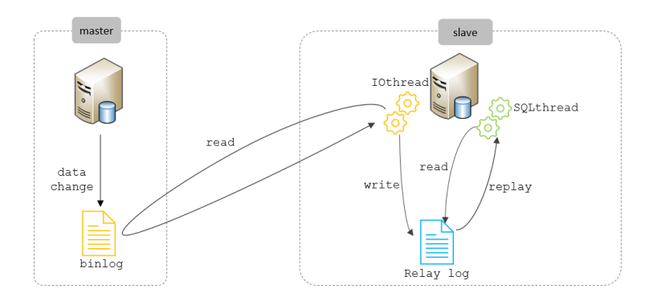

从上图来看，复制分成三步： 

1. Master 主库在事务提交时，会把数据变更记录在二进制日志文件 Binlog 中。 
2. 从库读取主库的二进制日志文件 Binlog ，写入到从库的中继日志 Relay Log 。 
3. slave重做中继日志中的事件，将改变反映它自己的数据。

启用主从配置:

```sql
CHANGE MASTER TO MASTER_HOST='192.168.200.200', MASTER_USER='itcast',
MASTER_PASSWORD='Root@123456', MASTER_LOG_FILE='binlog.000004',
MASTER_LOG_POS=663;
```

| 参数名          | 含义               | 8.0.23之前      |
| --------------- | ------------------ | --------------- |
| SOURCE_HOST     | 主库IP地址         | MASTER_HOST     |
| SOURCE_USER     | 连接主库的用户名   | MASTER_USER     |
| SOURCE_PASSWORD | 连接主库的密码     | MASTER_PASSWORD |
| SOURCE_LOG_FILE | binlog日志文件名   | MASTER_LOG_FILE |
| SOURCE_LOG_POS  | binlog日志文件位置 | MASTER_LOG_POS  |


## 3 Sever层优化

###  3.1 join_buffer

1. 作用与适用场景 

   - **核心功能**：在 JOIN 操作中缓存驱动表的关联数据块，减少对被驱动表的扫描次数，主要用于 Block Nested-Loop Join (BNL) 算法。
   - **适用场景**：
     - 被驱动表无索引或无法利用索引进行关联时。
     - 多表 JOIN 操作中，需要临时缓存中间结果以减少 I/O 操作。

2. **工作原理**

   - **缓存流程**：
     1. 从驱动表（如左表）中读取一批记录（由 join_buffer_size 控制容量）并存入内存。
     2. 全表扫描被驱动表（如右表），将每行数据与缓存块中的记录逐个匹配。
     3. 匹配成功则输出结果，否则继续下一轮缓存块的加载。
   - 算法特点：
     - 减少被驱动表的全表扫描次数（从 M 次降低为 M / buffer_size 次）。
     - 性能优于 Simple Nested-Loop Join，但仍可能引发高内存消耗和磁盘 I/O 问题。

   

3. 关键参数与优化

   - join_buffer_size：
     - 默认值：256KB（8.0 版本后提升至 1MB）。
     - 调整原则：根据 JOIN 的数据量动态设置。建议：
       - 单线程临时调整：SET SESSION join_buffer_size = 8M;
       - 全局优化：在 my.cnf 中设置为 1M-8M，避免过大导致内存碎片。
   - 优化策略：
     - **优先使用索引**：为被驱动表的关联字段添加索引，避免 BNL 退化为全表扫描。
     - **减少 JOIN 表的数据量**：通过 WHERE 条件或子查询缩小驱动表的结果集。


### 3.2 sort_buffer

二、sort_buffer（排序缓存）
1. 作用与适用场景
  1. **核心功能**：处理 ORDER BY、GROUP BY、DISTINCT 等排序操作，提供内存暂存区。
  2. **适用场景**：
        1. 无法通过索引直接排序时（执行计划显示 Using filesort）。
            2. 排序数据量小于 sort_buffer_size 时，完全内存排序；否则触发磁盘临时文件（外部排序）。
2. 工作原理
  1. **内存排序流程**：
        1. 从存储引擎读取待排序数据至 sort_buffer。
            2. 基于排序字段进行快速排序（单字段）或归并排序（多字段）。
                3. 返回有序结果集。
                    4. 磁盘排序触发条件：
                        5. 数据量超过 sort_buffer_size。
                            6. 使用多路归并算法（Sort_merge_passes 记录合并次数），性能显著下降。
3. 关键参数与优化
  1. **sort_buffer_size**：
        1. 默认值：1MB（生产环境建议调整为 8M-64M）。
            2. 调整策略：根据 Sort_merge_passes 监控指标动态调整，若该值频繁增长需增大缓冲区。
  2. 其他相关参数：
        1. max_sort_length：单行参与排序的最大字节数（默认 1024），避免处理超大字段。
            2. tmpdir：指定磁盘临时文件路径，确保足够的存储空间。
  3. 优化策略：
        1. **索引覆盖排序**：通过复合索引实现“无需排序”（执行计划显示 Using index）。
            2. **分页优化**：对大数据量排序使用 LIMIT 限制结果集，减少内存占用。


# InnoDB框架

让我们来探索一下InnoDB的深奥吧

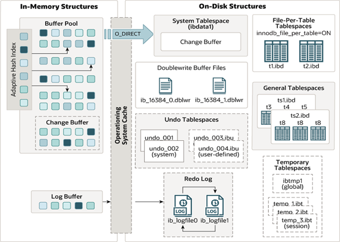

其中左侧为内存结构 右侧为磁盘结构

画个图  哈哈哈

```txt
+---------------------------------------+
|         应用程序/MySQL Server          |  ←  SQL接口、解析器、优化器等
+---------------------------------------+
                   |
                   ↓
+---------------------------------------+
|             InnoDB 存储引擎            |
| +-----------------+ +---------------+ |
| |  内存结构 (In-Memory Structures)   | |
| | +-------------------------------+ | |
| | |        Buffer Pool (缓冲池)     | | |  ← 缓存数据页（核心性能组件）
| | |  +----------------------------+ | | |
| | |  |   Change Buffer (写缓冲)    | | | |  ← 缓存非唯一索引的变更
| | |  +----------------------------+ | | |
| | +-------------------------------+ | |
| | |        Log Buffer (日志缓冲)   | | |  ← 临时存储 redo log
| | +-------------------------------+ | |
| +-----------------+ +---------------+ |
|                   |                   |
| +-----------------+ +---------------+ |
| | 后台线程 (Background Threads)    | |
| | +-------------------------------+ | |
| | | Master Thread (主线程)         | | |  ← 协调刷新、检查点、清理等
| | +-------------------------------+ | |
| | | IO Threads (读写线程)          | | |  ← 处理异步IO（read/write）
| | +-------------------------------+ | |
| | | Purge Thread (清理线程)        | | |  ← 删除无用的undo日志
| | +-------------------------------+ | |
| | | Page Cleaner Thread (刷脏线程)| | |  ← 专用刷脏页线程
| | +-------------------------------+ | |
| +-----------------+ +---------------+ |
|                   |                   |
| +-----------------+ +---------------+ |
| |   磁盘结构 (On-Disk Structures)   | |
| | +-------------------------------+ | |
| | |      Tablespaces (表空间)      | | |
| | |  +--------------------------+ | | |
| | |  | System Tablespace        | | | |  ← 存储元数据、undo logs、双写缓冲等
| | |  | (ibdata1)                | | | |
| | |  +--------------------------+ | | |
| | |  | File-Per-Table Tablespace| | | |  ← 每个表独立.ibd文件（默认）
| | |  | (.ibd files)             | | | |
| | |  +--------------------------+ | | |
| | |  | General Tablespace       | | | |  ← 用户自定义共享表空间
| | |  +--------------------------+ | | |
| | +-------------------------------+ | |
| | |      Redo Log Files          | | |  ← 事务持久性保证（ib_logfile0,1）
| | | (重做日志)                   | | |
| | +-------------------------------+ | |
| | |      Undo Logs (回滚日志)     | | |  ← 实现事务回滚/MVCC（存于系统表空间）
| | +-------------------------------+ | |
| | |      Doublewrite Buffer      | | |  ← 防止页断裂（存于系统表空间）
| | | (双写缓冲)                   | | |
| | +-------------------------------+ | |
| +-----------------------------------+ |
+---------------------------------------+
```


## 1. 内存结构

### 1.1 Buffer Poll

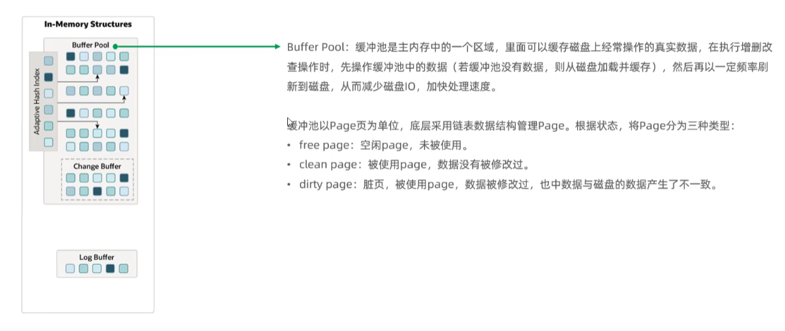

1. 核心作用

   - **数据缓存**：将磁盘上的数据页（16KB/页）缓存到内存，减少物理 I/O。

   - **写缓冲**：延迟非唯一索引的修改操作，合并写入以优化随机 I/O。

2. **组成结构**

   ```txt
   +-----------------------------+
   |        Buffer Pool          |
   | +-------------------------+ |
   | |       Data Pages        | | ← 表数据页（含索引）
   | +-------------------------+ |
   | |    Change Buffer        | | ← 专用于缓存非唯一索引变更
   | +-------------------------+ |
   | | Adaptive Hash Index     | | ← 自动为热点页构建哈希索引
   | +-------------------------+ |
   | |    Free List            | | ← 管理空闲页
   | +-------------------------+ |
   | |   LRU List (冷热分区)    | | ← 管理已加载页的访问频率
   | |   [New Sublist (5/8)]   | | ← 热点数据区（最近访问）
   | |   [Old Sublist (3/8)]   | | ← 冷数据区（较早访问）
   | +-------------------------+ |
   | |   Flush List            | | ← 记录脏页（待刷盘）
   | +-------------------------+ |
   +-----------------------------+
   ```

3. **核心技术细节**

   - **页管理机制**：
     - **LRU List**：
       - 传统 LRU 易被全表扫描污染 → InnoDB 将 LRU 分为 **热数据区（5/8）** 和 **冷数据区（3/8）**。
       - 新页首次加载插入到冷数据区头部，只有**连续访问**后才移至热数据区。
       - 参数：`innodb_old_blocks_pct`（冷区比例），`innodb_old_blocks_time`（冷页晋升热区的等待时间）。
     - **Free List**：管理空闲页，当需要加载新页时从此获取空间。
     - **Flush List**：按修改时间（LSN）排序的脏页链表，用于刷盘。
   - **Change Buffer 写优化**：
     - 适用场景：仅缓存对 **非唯一索引** 的 `INSERT`/`UPDATE`/`DELETE` 操作（唯一索引需检查唯一性，必须读盘）。
     - **合并时机**：当相关索引页被加载到 Buffer Pool 时，将 Change Buffer 中的变更合并到页。
     - **节省 I/O**：例如批量插入时，多次索引修改合并为一次物理写操作。
     - 参数：`innodb_change_buffer_max_size`（默认25%，占 Buffer Pool 的比例）。

   - **自适应哈希索引（AHI）**：
     - **原理**：监控频繁访问的索引页，自动为**等值查询**（`WHERE key=xxx`）构建哈希索引（O(1) 查询）。
     - **触发条件**：同一索引页被连续访问超过 17 次（可配置）。
     - 限制：仅支持等值查询，不支持范围扫描。参数：`innodb_adaptive_hash_index=ON/OFF`。

   

4. **关键流程**

   - 数据读取：
     1. 查询页是否在 Buffer Pool 中（通过表空间ID+页号哈希查找）。
     2. 命中则返回；未命中则从磁盘读入 Free List 的空闲页（若无空闲页，触发 LRU 淘汰）。
     3. 页插入到 LRU 冷数据区头部。
   - 数据修改：
     1. 修改 Buffer Pool 中的页（标记为脏页）。
     2. 若涉及非唯一索引，操作写入 Change Buffer。
     3. 生成 Redo Log 记录写入 Log Buffer。
   - **刷脏页（Flush）**：
     - **触发条件**：
       - Checkpoint 机制（确保 Redo Log 可覆盖）「到此为止的数据已刷盘」（类似快递已送达确认点）。
       - 空闲页不足（触发 LRU 淘汰脏页）。
       - 后台线程定时刷新（由 `innodb_io_capacity` 控制每秒 I/O 量）。
     - **刷盘路径**：脏页通过 Doublewrite Buffer 写入表空间文件（防页断裂）。


缓冲池以**Page页为单位**，底层采用链表数据结构管理Page。根据状态，将Page分为三种类型： 

- free page：空闲page，未被使用。 
- clean page：被使用page，数据没有被修改过。 
- dirty page：脏页，被使用page，数据被修改过，也中数据与磁盘的数据产生了不一致。


#### 1.1.1 Free链表

**作用：管理空闲页，当需要加载新页时从此获取空间。**

当我们最初启动 MySQL 服务器的时候，需要完成对 Buffer Pool 的初始化过程，就是先向操作系统**申请 Buffer Pool 的内存空间**，然后把它划分成若干对控制块和缓存页 。这时候缓存页还没有用上，所以都是空闲页。那么要怎么区分空闲页呢？当然是靠控制块了。

首先每个控制块都有两个 指针，用来关联空闲的上下两个控制块。innodb再定义了一个free控制块的基点，将所有空闲的控制块串联成双向链表，称为free链表。

有了这个 free链表 之后事儿就好办了，每当需要从磁盘中加载一个页到 Buffer Pool 中时，就从 free链表 中 取一个空闲的缓存页，并且把该缓存页对应的 控制块 的信息填上（就是该页所在的表空间、页号之类的信 息），然后把该缓存页对应的 free链表 节点从链表中移除，表示该缓存页已经被使用了～  

注意：free的基点不占用bufferpool的内存空间


#### 1.1.2 Flush链表

**作用：按修改时间（LSN）排序的脏页链表，用于刷盘。**

如果我们修改了 Buffer Pool 中某个缓存页的数据，那它就和磁盘上的页不一致了，这样的缓存页也被称为
脏页（英文名： dirty page ）  。这些脏页不会急着加载进磁盘，会等一段时间，有可能一个页累计了好多次的修改，统一刷进磁盘，称为刷脏。问题来了，**怎么知道哪些页是脏页**？

我们依然维护了一个flush链表的基点，然后控制块也多维护了两个flush的指针，所有被修改过的页，都会加进flush链表。在未来的某个时间段，被我们的后台线程异步的刷进磁盘。


#### 1.1.3 LRU链表

**作用：管理已加载页的访问频率**

传统的LRU机制  在Buffer Pool快要满了的时候 就会移除一些页  通过LRU算法实现，但是传统的LRU存在一些问题

- 对于开启**预读**的Mysql 会在加载连续页 或者区的时候 异步的把剩余的一些页或者区也读出来 （实际没用）从而浪费缓存
- 针对没有索引的数据  每次访问会**全表扫描** 导致数据大量被放在缓冲区占用缓存区内存

因此对其进行了优化将其分为两个部分：一部分**叫热区young区**，一部分叫**冷区old区**。

默认情况下， old 区域大约占 LRU链 表 的 3/8 。这个比例我们是可以设置的，我们可以在启动时修改 innodb_old_blocks_pct 参数来控制 old 区域 在 LRU链表 中所占的比例，比方说这样修改配置文件： [server] innodb_old_blocks_pct = 40  

- 针对预读的页面在初次加载进缓存的时候，就在冷区的头部，后续有被访问，才会到热区
- 针对于全表扫描这类，页面一开始放到了冷区，紧接着就会马上被读到，重新进入了热区，怎么办？mysql提供了一个参数 innodb_old_blocks_time  说的是，在加载进缓存页后的多少秒，再次访问，才能把页面变到热区，正是用了冷热区，加上innodb_old_blocks_time  这个参数，才解决了头疼的问题。
- 针对于热区的缓存页，每次被访问就移到头结点也太累了，mysql还给它优化了一下，只有在热区尾部四分之一的位置时，才需要去移动。


#### 1.1.4 Change Buffer

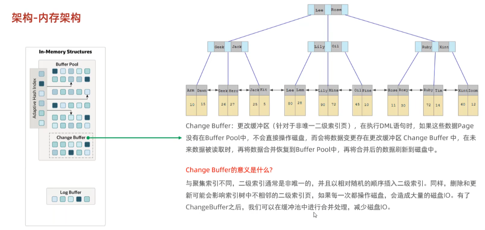

Change Buffer，**更改缓冲区（针对于非唯一二级索引页）**，在执行DML语句时，如果这些数据Page 没有在Buffer Pool中，不会直接操作磁盘，而会将数据变更存在更改缓冲区 Change Buffer中，在未来数据被读取时，再将数据合并恢复到Buffer Pool中，再将合并后的数据刷新到磁盘中。 

Change Buffer的意义是什么呢? 

先来看一幅图，这个是二级索引的结构图：

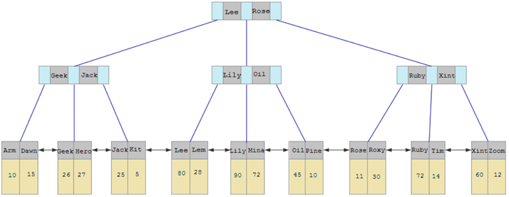

与聚集索引不同，二级索引通常是非唯一的，并且以相对随机的顺序插入二级索引。同样，删除和更新

可能会影响索引树中不相邻的二级索引页，如果每一次都操作磁盘，会造成大量的磁盘IO。有了 

ChangeBuffer之后，我们可以在缓冲池中进行**合并处理，减少磁盘IO**。


**工作流程详解**

Change Buffer 的工作流程可分为**操作暂存、合并（Merge）、持久化**三个阶段：  

1. **操作暂存阶段**

  1. **判断条件**：  

    - 用户发起对二级索引的数据变更操作（如插入/更新/删除）。  
    - InnoDB 检查目标数据页是否在 Buffer Pool 中：  
      - **若在内存中**：直接修改数据页，无需 Change Buffer。  
      - **若不在内存中**：将操作记录到 Change Buffer，并生成对应的 Redo Log 保证事务持久性。

2. **合并（Merge）阶段**

  合并操作将 Change Buffer 中的变更应用到数据页，触发条件包括：  

  - **主动读取数据页**：当后续查询需要访问该数据页时，系统将数据页加载到 Buffer Pool 并合并缓存的变更。  
  - **后台线程定期合并**：InnoDB 的主线程（Master Thread）每隔 10 秒执行一次 Merge 操作。  
  - **数据库关闭时**：确保所有变更持久化到磁盘。

3. **持久化阶段**

  - Change Buffer 本身是可持久化的，其数据结构（B+ 树）存储在系统表空间（ibdata1）中，通过 Checkpoint 机制定期刷盘。  
  - 变更操作最终通过 Redo Log 和 InnoDB 的脏页刷新机制写入磁盘索引页。


#### 1.1.5 自适应哈希索引（AHI）

**作用：自动为热点页构建哈希索引加快访问速度**

自适应hash索引，用于优化对Buffer Pool数据的查询。MySQL的innoDB引擎中虽然没有直接支持 

hash索引，但是给我们提供了一个功能就是这个自适应hash索引。因为前面我们讲到过，hash索引在 

进行等值匹配时，一般性能是要高于B+树的，因为hash索引一般只需要一次IO即可，而B+树，可能需 

要几次匹配，所以hash索引的效率要高，但是hash索引又不适合做范围查询、模糊匹配等。 

InnoDB存储引擎会监控对表上各索引页的查询，如果观察到在特定的条件下比如**等值查询**达到一定次数（可设置）17次 为其建立自适应hash索引  ，但是**不支持对范围查找**建立。

**自适应哈希索引，无需人工干预，是系统根据情况自动完成。** 

参数： adaptive_hash_index


### 1.2  Log Buffer

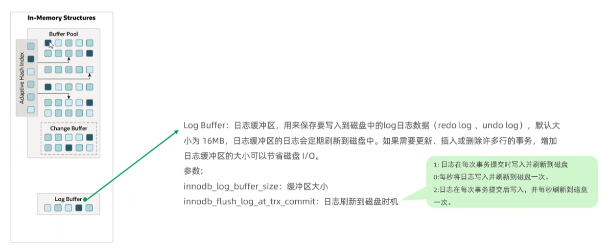

1. 核心作用
   - **Redo Log 的缓冲区**：临时存储事务产生的 **Redo** 日志（避免每次提交直接写磁盘）。
   - **批量 I/O 优化**：合并多个事务的日志写入，减少磁盘操作次数。

2. 组成结构

   ```txt
   +-----------------------------+
   |         Log Buffer         |
   | +-------------------------+ |
   | |   Redo Log Records      | | ← 按事务提交顺序存储
   | |   [Tx1: UPDATE ...]     | |
   | |   [Tx2: INSERT ...]     | |
   | +-------------------------+ |
   +-----------------------------+
            ↓
   +-----------------------------+
   |      Redo Log Files        |
   |    (ib_logfile0, ib_logfile1) | ← 循环写入的磁盘文件
   +-----------------------------+
   ```

   

3. **核心技术细节**

   - **Redo Log 内容**：
     - 记录**物理逻辑日志**：如 “在 Page X 的 Offset Y 写入 Z 字节数据”。
     - 仅记录索引页的修改，不记录二进制变更（区别于 Binlog）。

   - **写入与刷盘策略**：

     - **写入时机**：事务执行过程中，Redo Log 实时写入 Log Buffer。
     - **刷盘时机**（由 `innodb_flush_log_at_trx_commit` 控制）：

     | **参数值** | **行为**                     | **可靠性** | **性能** |
     | ---------- | ---------------------------- | ---------- | -------- |
     | **0**      | 每秒刷盘一次                 | 最低       | 最高     |
     | **1**      | 每次事务提交时刷盘（默认）   | 最高       | 最低     |
     | **2**      | 提交时写入 OS 缓存，每秒刷盘 | 中等       | 中等     |

   - Log Buffer 大小：
     - 参数 `innodb_log_buffer_size`（默认 16MB）。
     - 建议调整场景：大事务或高并发写入时，避免 Log Buffer 满导致额外刷盘。

4. 关键流程

   - **事务执行**：

     - 数据修改 → 生成 Redo Log 记录 → 存入 Log Buffer。
   - **事务提交**：
     - 根据 `innodb_flush_log_at_trx_commit` 决定是否强制刷盘：
       - 若为 **1**：调用 `fsync()` 将 Log Buffer 中的该事务日志写入 Redo Log 文件。
       - 若为 **2**：仅写入 OS 文件系统缓存（可能丢失最近1秒数据）。
   - **后台刷盘**：

     - Master Thread 每秒自动刷盘（无论参数为何值）。

   - **日志文件循环**：

     Redo Log 文件写满后，触发 Checkpoint → 将脏页刷盘 → 重用旧日志文件。


#### 1.2.1 Buffer Poll与Log Buffer协同

1. **数据加载**：
   - 从磁盘读取目标页到 Buffer Pool（若未缓存）。
2. **修改数据**：
   - 在 Buffer Pool 中修改页 → 标记为脏页 → 加入 Flush List。
   - 若修改非唯一索引 → 写入 Change Buffer。
3. **生成日志**：
   - 生成 Redo Log 记录 → 写入 Log Buffer。
4. **事务提交**：
   - 根据策略刷 Log Buffer 到磁盘（Redo Log Files）。
5. **后台刷脏**：
   - Page Cleaner Thread 异步将脏页刷盘（通过 Doublewrite Buffer 保证安全）。

> ⚙️ **关键设计思想**：
>
> - **日志先行（WAL）**：Redo Log 先于数据页落盘，确保崩溃恢复能力。
> - **批量处理**：Log Buffer 合并日志写，Change Buffer 合并索引更新，最大化 I/O 效率。
> - **内存优先**：Buffer Pool 减少读 I/O，Log Buffer 优化写 I/O。


## 2. 后台线程

### 2.1 Master Thread（主线程）

Master Thread 是 InnoDB 存储引擎的核心调度线程，负责协调其他后台线程的工作，并执行关键的数据持久化任务，确保内存与磁盘数据的同步以及事务的一致性。其设计体现了 InnoDB 在高并发、高可靠场景下的核心逻辑。

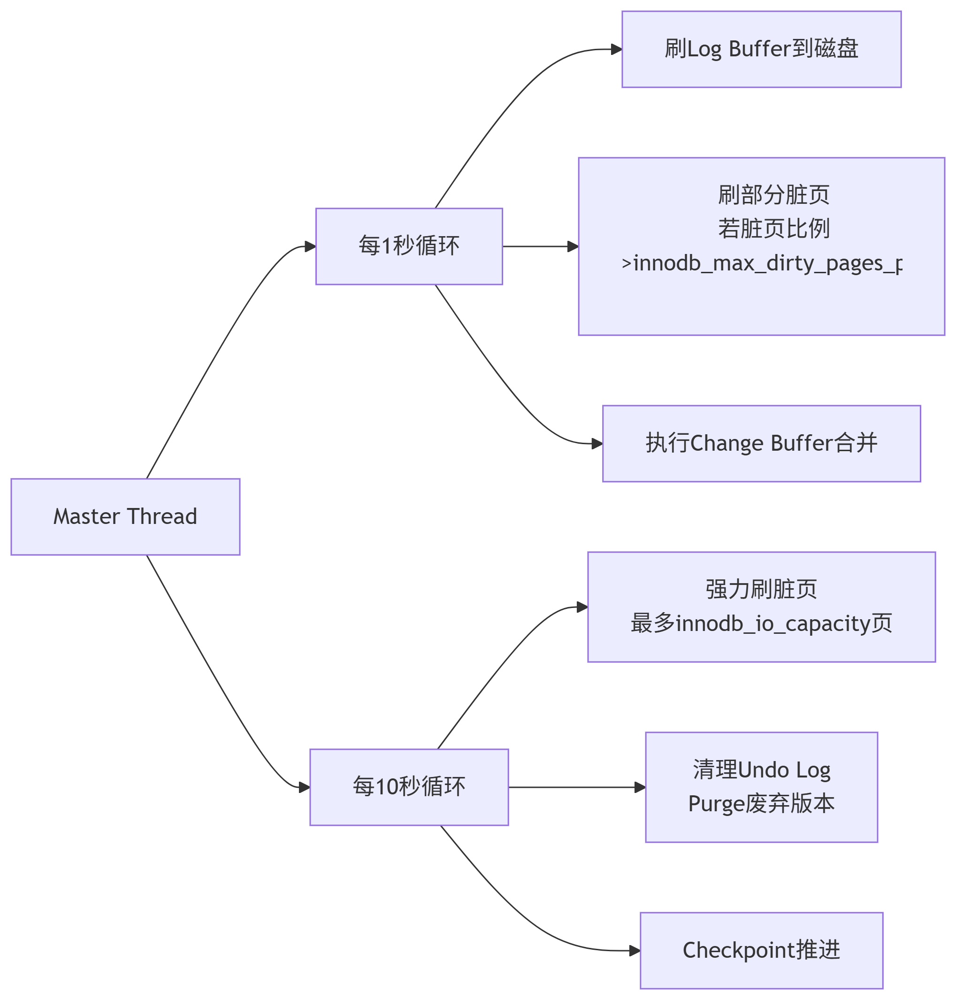

**1. 核心职责**

1. **异步数据刷新**  
   1. **脏页刷新**：定期将 Buffer Pool 中修改过的脏页（Dirty Page）刷新到磁盘，保证内存与磁盘数据的一致性。  
   2. **日志缓冲刷新**：将 Redo Log Buffer 中的日志内容刷新到磁盘的 Redo Log 文件，确保事务的持久性（ACID 中的 Durability）。
2. **合并插入缓冲（Insert Buffer Merge）**  
   - 对非唯一二级索引的变更（INSERT/UPDATE/DELETE）进行合并优化，减少随机 I/O 操作。仅当系统 I/O 压力较小时触发（如每秒 I/O 次数 < 5）。
3. **事务与 Undo 管理**  
   - **Undo 页回收**：清理已提交事务的 Undo 日志，释放空间供后续事务使用。  
   - **检查点（Checkpoint）**：触发模糊检查点（Fuzzy Checkpoint），将部分脏页写入磁盘，控制 Redo Log 文件的复用。


**2. 关键技术**：

- **自适应刷新**：根据脏页比例（`innodb_max_dirty_pages_pct`）和 I/O 能力（`innodb_io_capacity`）动态调整刷盘速度。
- **Checkpoint 机制**：
  - 定期将最老的脏页 LSN（Log Sequence Number）标记为检查点
  - 确保 Redo Log 可安全覆盖（崩溃恢复起始点）
- **压力传导**：当用户线程需要空闲页时，Master Thread 会被唤醒加速刷脏。


**3. 工作流程**

Master Thread 的运行由多个循环构成，通过休眠与唤醒机制平衡性能与资源消耗：  

1. **主循环**（Main Loop）  

   1. **每秒操作**：  
      - 强制刷新 Redo Log Buffer 到磁盘，无论事务是否提交（确保崩溃恢复能力）。  
      - 合并插入缓冲：根据 I/O 压力动态判断是否执行。  
      - 脏页刷新：若脏页比例超过阈值（innodb_max_dirty_pages_pct，默认 75%），刷新至多 100 个脏页。
   2. **每 10 秒操作**：  
      - 脏页刷新：强制刷新 100 个脏页（即使未达阈值）。  
      - 删除无用的 Undo 页，防止 Undo 表空间膨胀。  
      - 合并插入缓冲：强制合并 5 个操作。

2. **后台循环**（Background Loop）

   当无用户活动时，进入低优先级模式，执行轻量级任务（如 I/O 合并），减少 CPU 占用。


### 2.2 IO Threads（I/O 线程）

**核心作用**：处理所有异步磁盘 I/O，避免用户线程阻塞。

🔧 线程分类与运作：

| **线程类型**     | **数量参数**              | **处理内容**                     | **触发时机**                 |
| ---------------- | ------------------------- | -------------------------------- | ---------------------------- |
| **Read Thread**  | `innodb_read_io_threads`  | 数据页预读/随机读请求            | 用户查询触发预读或缓存未命中 |
| **Write Thread** | `innodb_write_io_threads` | 脏页刷盘、Change Buffer 合并写入 | Page Cleaner 提交刷盘任务    |
| **Log Thread**   | 1 (固定)                  | Redo Log 缓冲刷盘                | 事务提交或每秒刷新           |

关键技术：

- **异步 I/O 封装**：
  - Linux 使用 `libaio`，Windows 使用 Overlapped I/O
  - 通过 `io_submit()` 批量提交 I/O 请求
- **负载均衡**：多个文件时采用轮询分配（`innodb_file_per_table` 场景）

**读线程（Read Threads）**：负责将磁盘数据页异步加载到缓冲池（Buffer Pool），减少用户线程因等待磁盘 I/O 而阻塞 

**写线程（Write Threads）**：将缓冲池中的脏页（Dirty Pages）异步刷新到磁盘，确保数据持久性

**日志线程（Log Threads）**：将重做日志缓冲（Redo Log Buffer）异步写入磁盘的重做日志文件，支持事务的 ACID 特性，确保事务提交前日志持久化


### 2.3 Page Cleaner Thread（刷脏线程）

**核心作用**：**专职刷脏页**（MySQL 5.6+ 从 Master Thread 拆分）。

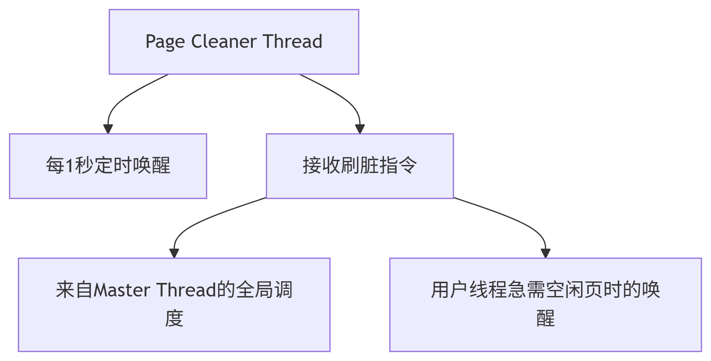

**一、核心功能**

1. **异步脏页刷新**  
   - **作用**：将 Buffer Pool 中已修改但未写入磁盘的脏页按策略刷新到数据文件，确保内存与磁盘数据一致性。 
   - **优化点**：通过批量刷新减少磁盘 I/O 次数，避免主线程（Master Thread）因同步刷盘导致性能抖动 。

1. **动态负载均衡**  
   - **自适应调节**：根据系统负载（如 IOPS、脏页比例）动态调整刷新频率。当 `innodb_max_dirty_pages_pct`（默认 75%）阈值被突破时，主动触发大规模脏页刷新。  
   - **优先级策略**：优先刷新即将被淘汰的 LRU（Least Recently Used）页，避免因内存不足导致用户查询阻塞。

1. **协作机制**  

   - **与 Master Thread 联动**：接收主线程周期性任务调度（如每秒/每十秒刷新指令），同时分担其脏页管理职责。 
   - **与 I/O Threads 协作**：通过异步 I/O 线程将脏页写入磁盘，避免阻塞主线程 

**二、工作流程**

 **触发条件**

1. **阈值触发**  

- - **脏页比例超限**：当 Buffer Pool 中脏页占比超过 `innodb_max_dirty_pages_pct`（默认 75%）时强制刷新。  
  - **Redo Log 空间不足**：当 Redo Log 即将被写满时，通过检查点（Checkpoint）机制触发快速刷盘，确保日志可循环复用。

1. **周期性调度**  

- - **主线程协调**：Master Thread 每秒检查脏页状态并分配刷新任务给 Page Cleaner。
  - **空闲时段刷新**：系统负载较低时，利用空闲 I/O 带宽完成增量刷新。

**执行阶段**

1. **脏页收集**  

- - **扫描 Buffer Pool**：从 LRU 链表或 Flush List 中筛选待刷新脏页，按修改时间（LSN）排序以减少随机 I/O。

1. **批量写入调度**  

- - **分批次刷新**：根据 `innodb_io_capacity` 参数（默认 200）控制每批次刷新的最大页数，避免突发 I/O 压力。  
  - **异步 I/O 提交**：通过预分配的 Write Threads 将脏页写入磁盘，支持并发操作以利用多核 CPU。

1. **检查点更新**  

- - **LSN 推进**：刷新完成后更新 Checkpoint LSN，标识已持久化的日志位置，缩短崩溃恢复时间。


  三、MySQL 8.0+ 优化特性

1. **多线程并行处理**  

- - 通过 `innodb_page_cleaners` 参数（默认 4）设置多个刷脏线程，每个线程负责一个 Buffer Pool 实例，提升并行效率。

1. **自适应刷新算法**  

- - 结合历史 I/O 负载预测未来需求，动态调整刷新速率，避免因过度刷盘导致性能波动。

1. **原子写入支持**  

- - 启用 16K 原子写技术后，关闭双写缓冲（Double Write Buffer），直接通过硬件保证页写入完整性，减少 I/O 开销。


**Page Cleaner Thread 是策略的制定者  负责高效的调度 扫描选择脏页 生成任务队列  真正执行脏页刷新磁盘的是 上面提到的io（Write Threads）线程**


###  2.4 Purge Thread（清理线程）

Purge Thread（清理线程） 是 InnoDB 存储引擎用于回收历史数据、释放存储空间并维护事务一致性的核心后台线程

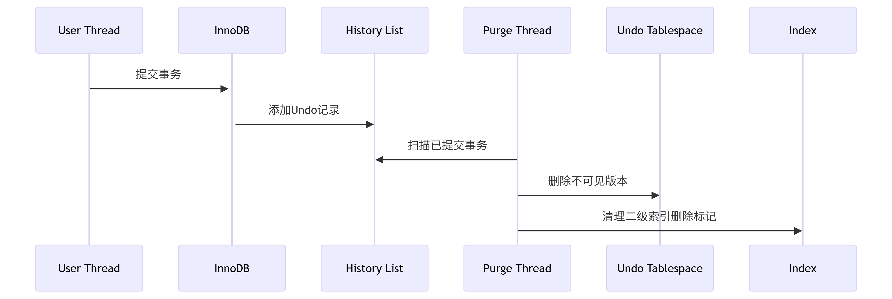


**1. 核心功能**

1. **回收 Undo 日志**  

- - 当事务执行 `UPDATE` 或 `DELETE` 操作时，InnoDB 不会立即物理删除数据，而是将旧版本数据存入 Undo 日志。Purge Thread 负责在这些数据不再被任何事务（包括读视图）引用后，清理对应的 Undo 页，释放空间。

2. **清理历史版本数据**  

- - 支持事务的多版本并发控制（MVCC），Purge Thread 移除已提交事务不再需要的旧数据版本，避免数据膨胀，优化查询性能。

3. **优化存储效率**  

- - 定期清理标记为删除（`delete mark`）的数据行，减少表碎片，提升磁盘空间利用率。

4. **多线程协作**  

- - 在 MySQL 5.7.8+ 后，Purge Thread 采用多线程架构（协调线程 + 工作线程），提升并发处理能力。默认配置为 4 个线程（1 个协调线程 + 3 个工作线程），可通过 `innodb_purge_threads` 调整。


**2. 工作流程**

 触发条件

1. **事务提交后**  

- - 当事务提交后，其产生的 Undo 日志会被标记为可清理状态，但需确保无活跃事务依赖该数据版本。

2. **系统负载空闲时**  

- - 在低 I/O 负载时，Purge Thread 主动清理历史数据，避免影响正常事务处理。

3. **强制清理阈值**  

- - 当 Undo 表空间使用量超过阈值（由 `innodb_max_undo_log_size` 控制）或表空间不足时触发强制清理。

**3. 执行流程**

1. 历史列表（History List）管理  

- - InnoDB 维护一个全局的 **历史列表（History List）**，记录所有待清理的旧数据版本。协调线程定期扫描该列表，将任务分发给工作线程。

2. 任务分发与并行处理  

- - **协调线程（Coordinator Thread）**：负责分配待清理的 Undo 段，并监控工作线程状态。
  - **工作线程（Worker Thread）**：执行具体的清理操作，包括删除旧数据行、回收 Undo 页等。每个工作线程独立处理分配的 Undo 段，避免锁争用。

3. 清理阶段  

- - **阶段1（Purge Batch）**：批量处理一组 Undo 记录，确保高效性。
  - **阶段2（Truncate Undo Log）**：当 Undo 表空间空闲比例较高时，触发 `TRUNCATE UNDO LOG`，释放物理文件空间。

4. 动态调节机制

- - 根据系统负载自动调整工作线程数量。例如，高并发时增加线程数，空闲时减少以节省资源。

**4. 性能调优参数**

| **参数**                   | **作用**                                  | **建议值**             |
| -------------------------- | ----------------------------------------- | ---------------------- |
| `innodb_purge_threads`     | 控制 Purge Thread 总数（默认 4）          | 高并发场景可增至 8-16  |
| `innodb_max_undo_log_size` | 设置单个 Undo 表空间的最大大小（默认 1G） | 根据磁盘容量调整       |
| `innodb_purge_batch_size`  | 每批次处理的 Undo 记录数（默认 300）      | 可适当增大以提升吞吐量 |

**5. 与其他线程的协作**

- **Master Thread**：接收周期性任务指令（如每秒/每十秒触发检查点），协调 Purge Thread 优先级 。
- **Page Cleaner Thread**：清理脏页时可能触发关联 Undo 数据的回收。
- **I/O Threads**：异步写入清理后的数据变更，减少主线程阻塞。


### 2.5 线程之间的协同

**线程协同工作原理（以 UPDATE 为例）**

1. **用户线程**：
   - 修改 Buffer Pool 数据页 → 生成 Redo Log 写入 Log Buffer
2. **Log Thread**：
   - 事务提交时将 Log Buffer 刷盘（若 `innodb_flush_log_at_trx_commit=1`)
3. **Page Cleaner Thread**：
   - 异步将脏页通过 Doublewrite Buffer 刷入表空间文件
4. **Purge Thread**：
   - 事务提交后清理该事务的 Undo Log 历史版本
5. **Master Thread**：
   - 每秒调度全局任务，推进 Checkpoint LSN


⚠️ **设计精髓**：

- **并行化**：将 I/O、Purge、刷脏分离到独立线程，充分利用多核 CPU
- **异步化**：用户线程几乎不直接操作磁盘，通过后台线程延迟处理
- **自适应**：根据系统负载动态调整资源分配（如刷脏速度）


## 3. 磁盘结构

### 3.1 表空间（Tablespaces）

1. 核心作用
   - **数据持久化存储**：所有用户数据、索引、元数据、系统数据的最终存储容器
   - **空间管理单元**：InnoDB 存储引擎的最高层逻辑存储结构（段→区→页→行）
   - **多模式支持**：提供系统表空间、独立表空间、通用表空间等多种存储策略

2. 组成结构


1. 表空间

   表空间是InnoDB存储引擎逻辑结构的最高层， 如果用户启用了参数 innodb_file_per_table(在 8.0版本中默认开启) ，则每张表都会有一个表空间（xxx.ibd），一个mysql实例可以对应多个表空 间，用于存储记录、索引等数据。 

2. 段 

   分为数据段（Leaf node segment）、索引段（Non-leaf node segment）、回滚段（Rollbacksegment），InnoDB是索引组织表，数据段就是B+树的叶子节点， 索引段即为B+树的 非叶子节点。段用来管理多个Extent（区）。 按功能划分存储单元，例如一个索引对应两个段（叶子段+非叶子段）；段空间管理采用INODE Entry结构（存储于系统表空间）

3. 区 

   表空间的单元结构，**连续的64个页**，默认大小1MB（页大小16KB×64）。一次分配4-5个区，避免频繁申请碎片化，提升I/O连续性

4. 页 

   页，是InnoDB 存储引擎磁盘管理的**最小单元**，每个页的大小默认为 16KB。为了保证页的连续性， InnoDB 存储引擎每次从磁盘申请 4-5 个区。 

5. 行 

   行，InnoDB 存储引擎数据是按行进行存放的。 

   在行中，默认有两个隐藏字段： 

   ​	**Trx_id**：每次对某条记录进行改动时，都会把对应的事务id赋值给trx_id隐藏列。 

   ​	**Roll_pointer**：每次对某条引记录进行改动时，都会把旧的版本写入到undo日志中，然后这个 

   ​	隐藏列就相当于一个指针，可以通过它来找到该记录修改前的信息。

3. **组成分类**

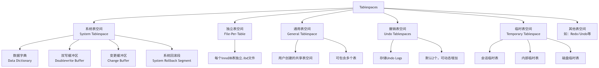

- 系统表空间 (System Tablespace)
- 独立表空间 (File-Per-Table Tablespace)
- 通用表空间 (General Tablespace)
- 撤销表空间 (Undo Tablespaces)
- 临时表空间 (Temporary Tablespace)
- 其他表空间

**表空间类型对比表**

| 特性           | 系统表空间 | 独立表空间   | 通用表空间 | 撤销表空间 | 临时表空间 |
| -------------- | ---------- | ------------ | ---------- | ---------- | ---------- |
| **存储内容**   | 系统数据   | 单表数据     | 多表数据   | Undo日志   | 临时数据   |
| **文件扩展名** | .ibdata    | .ibd         | .ibd       | .ibu       | .ibt       |
| **是否共享**   | 是         | 否           | 是         | 是         | 会话级     |
| **默认数量**   | 1          | 每表1个      | 用户创建   | 2          | 1主+多会话 |
| **可收缩**     | ❌          | ✅            | ✅          | ✅          | ✅(重启)    |
| **8.0改进**    | Undo移出   | 默认启用     | 增强       | 独立+动态  | 会话级优化 |
| **最佳实践**   | 仅系统数据 | 推荐大多数表 | 表组管理   | 自动管理   | 监控大小   |


#### 3.1.1 系统表空间 (System Tablespace)

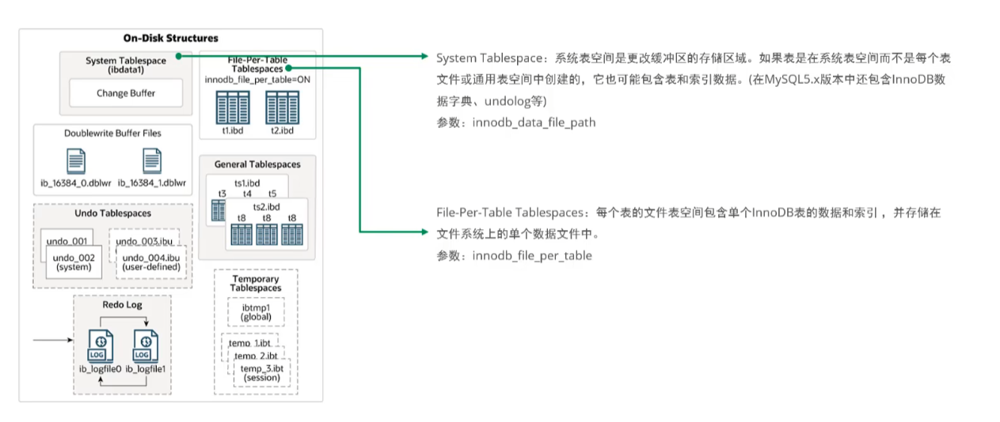

- **作用**：系统表空间主要用于存储数据字典信息，比如表结构、索引结构这些元数据，这能让数据库快速准确地知道每张表的结构和相关属性。而且，回滚段也可能存储在系统表空间里，回滚段对事务处理很重要，比如在事务回滚时能恢复数据到原来状态。

- 文件标识：`ibdata1`（默认名称）

- 核心组成：包含数据字典（表结构等元数据）、Undo日志（回滚段）、双写缓冲（Doublewrite Buffer）、

  Change Buffer（修改缓冲）等核心信息。即使启用了独立表空间，这些全局数据仍存储在此

  - **数据字典**：存储数据库对象元数据（表、列、索引等定义）
  - **双写缓冲区**：防止页断裂的备份区域（8.0.20+可独立）
  - **变更缓冲区**：缓存对非唯一索引的更改
  - **系统回滚段**：用于系统事务的撤销日志存储

- 使用时机：

  - 存储MySQL内部系统数据（如数据字典）
  - 当未启用独立表空间（`innodb_file_per_table=OFF`）时存储所有用户数据（**不推荐**）

- 关键特性：

  ```sql
  -- 配置文件示例
  [mysqld]
  innodb_data_file_path = ibdata1:12M:autoextend
  ```

  - 一旦分配无法收缩（即使删除数据）
  - MySQL 8.0将用户表的Undo Log移出系统表空间


#### 3.1.2 独立表空间 (File-Per-Table Tablespace)

- **作用：**相比于系统表空间，独立表空间呢，能让我们更灵活地管理数据。比如你可以把某个表的数据和索引单独放在独立表空间，这样在备份、恢复或者迁移数据的时候就更方便，还能避免系统表空间过大导致的性能问题。简单说，系统表空间像 “大管家” 负责整体事务，独立表空间是 “小助手”，提供个性化服务啦。

- **文件标识**：`表名.ibd`（位于数据库目录下）

- **核心组成**：

  - 单表的全部数据+索引
  - 表元数据（如表空间ID、索引根页指针）

- **使用时机**：

  - **默认启用**（`innodb_file_per_table=ON`）
  - 需要表压缩、传输表空间或快速`TRUNCATE TABLE`时

- **优势**：

  - **空间回收**：`DROP TABLE`直接删除.ibd文件
  - **备份灵活**：支持可传输表空间
  - **多线程清理**：删除表时不会锁整个系统表空间

- **监控**：

  ```sql
  SELECT * FROM information_schema.INNODB_TABLESPACES 
  WHERE NAME LIKE '%test/t1%';  -- 格式：数据库名/表名
  ```


#### 3.1.3 通用表空间 (General Tablespace)

- **作用**：通用表空间可以看作是系统表空间和独立表空间的一个折中方案啦。它能像独立表空间那样，把数据和索引存储在单独的文件里，方便管理和维护。同时呢，又能支持多个表共享同一个表空间，多个小表可以把数据都放在里面，大家一起用这个存储空间，这样能更合理地利用磁盘，节省磁盘空间。在一些特定场景下，比如多个小表共享存储资源的时候，通用表空间就挺有用的。

- **文件标识**：用户自定义（如`shared_space.ibd`）

- **核心组成**：

  - 多个表的共享存储池
  - 支持所有行格式（包括`COMPRESSED`）

- **使用时机**：

  - 合并存储多个表，减少小文件碎片
  - 需要表压缩但文件系统块大小不足时

- **操作示例**：

  ```sql
  -- 创建通用表空间
  CREATE TABLESPACE `shared_space` 
    ADD DATAFILE 'shared_space.ibd' 
    FILE_BLOCK_SIZE = 16K;  -- 指定块大小
  
  -- 将表加入通用表空间
  CREATE TABLE t1 (id INT) TABLESPACE `shared_space`;
  ALTER TABLE t2 TABLESPACE `shared_space`;
  ```

- **限制**：

  - 不支持临时表
  - 表移动后无法直接返回独立表空间


#### 3.1.4 撤销表空间 (Undo Tablespaces)

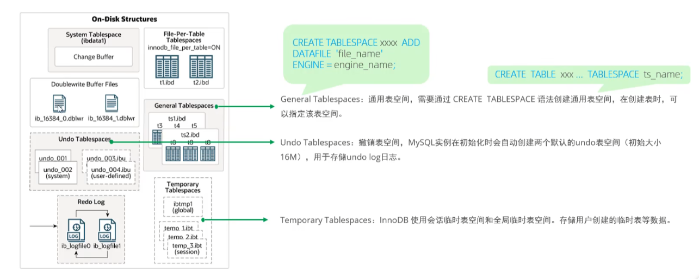

- **作用**：存储的是undo log 文件。当事务执行回滚操作时，就会从撤销表空间读取 undo log 里的信息，把数据恢复到事务开始前的状态。而且，它还能保证事务的一致性和隔离性呢。

- 文件标识：`undo_001`, `undo_002`（默认）

- **使用时机**：

  - 所有用户事务的Undo Log存储
  - 需要长时间运行的事务或高并发写负载

- **关键特性**：

  - 默认创建2个，可在线动态增加：

    ```sql
    CREATE UNDO TABLESPACE undo_003 ADD DATAFILE 'undo_003.ibu';
    ```

  - 自动截断：当表空间超过`innodb_max_undo_log_size`后清理

  - 状态管理：`ACTIVE`/`INACTIVE`

    ```sql
    ALTER UNDO TABLESPACE undo_003 SET INACTIVE;
    ```

- 监控：

  ```sql
  SELECT NAME, STATE FROM INFORMATION_SCHEMA.INNODB_TABLESPACES 
  WHERE NAME LIKE '%undo%';
  ```


#### 3.1.5 临时表空间 (Temporary Tablespace)

- **作用**：当查询中用到临时表，像做排序、分组或者创建临时视图的时候，就会用到它。还有在处理复杂查询、创建临时中间结果时，也会用到临时表空间。它能避免占用系统表空间，提高查询效率呢。

- **文件标识**：

  - 用户临时表空间：`ibtmp1`
  - 会话临时表空间：`#innodb_temp/temp_*.ibt`

- **核心组成**：

  - 会话临时表数据
  - 内部临时表（如排序缓冲区）

- **使用时机**：

  - 执行需要磁盘临时表的查询
  - 用户创建临时表（`CREATE TEMPORARY TABLE`）

- **关键特性**：

  - 动态收缩：重启MySQL自动重建ibtmp1
  - 会话级优化：会话退出自动清理

- **配置**：

  ```ini
  innodb_temp_data_file_path = ibtmp1:12M:autoextend:max:5G
  ```

- **监控**：

  ```sql
  SELECT FILE_NAME, TABLESPACE_NAME, ENGINE, INITIAL_SIZE 
  FROM INFORMATION_SCHEMA.FILES 
  WHERE FILE_NAME LIKE '%ibtmp%';
  ```


#### 3.1.6 其他表空间

- **Redo Log表空间**（8.0.30+）：
  - 替代传统的ib_logfile*
  - 存储在`#innodb_redo`目录
  - 支持动态调整数量和大小
- **MySQL数据字典表空间**：
  - `mysql.ibd`文件
  - 存储数据字典表（如tables、columns）
- **全局临时表空间**：
  - 存储`CREATE TEMPORARY TABLE`创建的全局临时表


### 3.2 Redo Log（Redo Log Files）

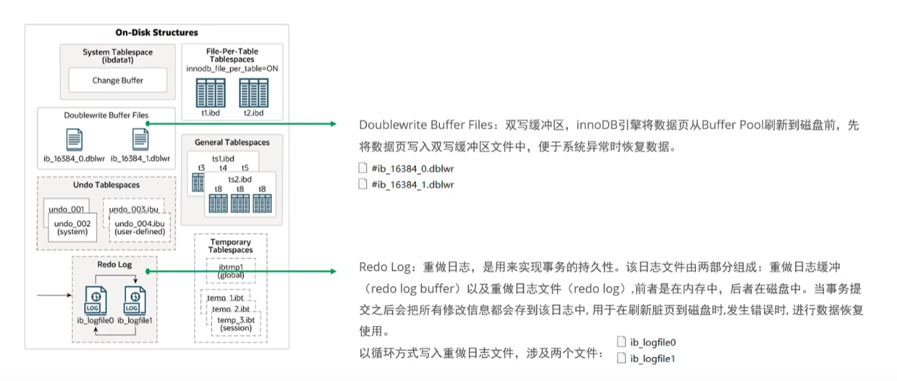

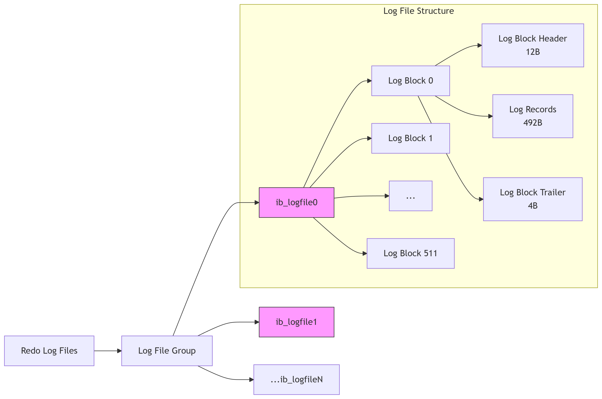

**作用**：就是在数据库执行过程中记录数据修改结果，在数据库发生故障时通过恢复这些记录来保证数据的完整性和一致性。


#### 3.2.1 执行流程

**流程**：重做日志，记录的是事务提交时数据页的物理修改，是用来实现事务的持久性。 记录的是**修改后的结果数据**。

该日志文件由两部分组成：重做日志缓冲（redo log buffer）以及重做日志文件（redo log file）,前者是在内存中，

后者在磁盘中。当事务提交之后会把所有修改信息都存到该日志文件中, 用 于在刷新脏页到磁盘,发生错误时, 进行

数据恢复使用。 

如果没有redolog，可能会存在什么问题的？ 我们一起来分析一下。我们知道，在InnoDB引擎中的内存结构中，主

要的内存区域就是缓冲池，在缓冲池中缓存了很多的数据页。 当我们在一个事务中，执行多个增删改的操作时，

InnoDB引擎会先操作缓冲池中的数据，如果缓冲区没有对应的数据，会通过后台线程将磁盘中的数据加载出来，

存放在缓冲区中，然后将缓冲池中 的数据修改，修改后的数据页我们称为脏页。 而脏页则会在一定的时机，通过

后台线程刷新到磁盘 中，从而保证缓冲区与磁盘的数据一致。 而缓冲区的脏页数据并不是实时刷新的，而是一段

时间之后 将缓冲区的数据刷新到磁盘中，假如刷新到磁盘的过程出错了，而提示给用户事务提交成功，而数据却 

没有持久化下来，这就出现问题了，没有保证事务的持久性。 

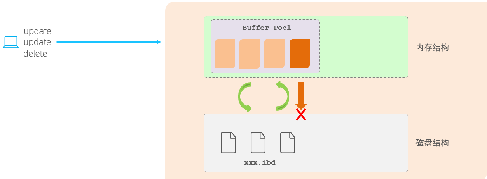

那么，如何解决上述的问题呢？ 在InnoDB中提供了一份日志 redo log，接下来我们再来分析一 下，通过redolog如何解决这个问题。 

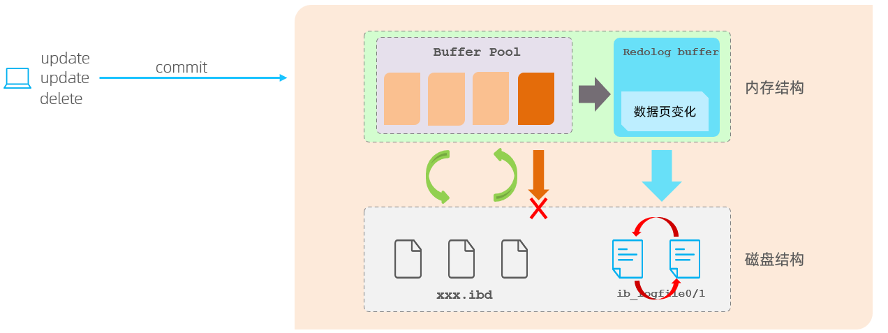

有了redolog之后，当对缓冲区的数据进行增删改之后，会首先将操作的数据页的变化，记录在redo log buffer中。

在事务提交时，会将redo log buffer中的数据刷新到redo log磁盘文件中。 

过一段时间之后，如果刷新缓冲区的脏页到磁盘时，发生错误，此时就可以借助于redo log进行数据恢复，这样就

保证了事务的持久性。 而如果脏页成功刷新到磁盘 或 或者涉及到的数据已经落盘，此时redolog就没有作用了，

就可以删除了，所以存在的**两个redolog文件是循环写**的。


#### 3.2.2 组成结构

1. 日志记录格式（物理逻辑日志）

```txt
// 示例
LSN=12345678 | TRX_ID=789 | SPACE_ID=5 | PAGE_NO=1023 | OP=UPDATE | OFFSET=60 | DATA="Alice→Bob"

// 数据组成
| LSN(8B) | 事务ID(6B) | 表空间ID(4B) | 页号(4B) | 操作类型(1B) | 数据偏移(2B) | 修改数据(...) |
```

2. 关键字段解析

| 字段         | 作用                        | 类比解释              |
| ------------ | --------------------------- | --------------------- |
| **LSN**      | 日志序列号（全局递增）      | 操作的时间戳+流水号   |
| **TRX_ID**   | 产生日志的事务ID            | 操作责任人工号        |
| **SPACE_ID** | 表空间ID（哪个数据库文件）  | 仓库编号              |
| **PAGE_NO**  | 数据页号（文件内位置）      | 仓库的货架编号        |
| **OP**       | 操作类型（INSERT/UPDATE等） | 操作类型（入库/出库） |
| **DATA**     | 修改前后的数据差异          | 货物变更清单          |


#### 3.2.3 刷盘时机

配置 **innodb_flush_log_at_trx_commit**  参数，可以设置事务提交时的刷盘方式

-  **0** ：当该系统变量值为0时，表示在事务提交时不立即向磁盘中同步 redo 日志，这个任务是交给后台线程 做的。 这样很明显会加快请求处理速度，但是如果事务提交后服务器挂了，后台线程没有及时将 redo 日志刷新到 磁盘，那么该事务对页面的修改会丢失。 

- **1** ：当该系统变量值为1时，表示在事务提交时需要将 redo 日志同步到磁盘，可以保证事务的 持久性 。 1 也是 innodb_flush_log_at_trx_commit 的默认值。 

- **2** ：当该系统变量值为2时，表示在事务提交时需要将 redo 日志写到操作系统的page cache中，但并不需要保 证将日志真正的刷新到磁盘。 这种情况下如果数据库挂了，操作系统没挂的话，事务的 持久性 还是可以保证的，但是操作系统也挂了的 话，那就不能保证 持久性 了。  

  一般我们都配1，保证持久性。


#### 3.2.4 崩溃恢复

故障恢复时，第一步是扫描 redo log 文件。从最近的 Checkpoint 记录开始，找到所有在 **Checkpoint** 之后修改的数据。把这些redolog中对应的页，再拉到缓存来，然后通过**redolog把这些缓存变成脏页**，之前的数据恢复到buffer poll。然后再根据**undolog**来判断对应的事务是提交还是回滚，主要取决于undolog中的状态是prepare还是commit。如果是prepare，看看binlog写成功了没，如果成功了，就还是能提交。


#### 3.2.5 存储模式

```txt
        写指针
          ↓
[Log File 1][Log File 2][Log File 3]
  ↑             ↑
  |_____________|
     已覆盖区域
```

当写满最后一个文件时，回到第一个文件覆盖写入 . 覆盖区域对应的脏页必须已刷盘（Checkpoint 已推进）


Redo Log 设计精髓总结

1. **顺序写加速**：将随机IO转换为顺序IO
2. **日志先行原则**：先保证操作可重放，再实际修改数据
3. **崩溃恢复三件套**：
   - Checkpoint（安全基点）
   - Redo（重做未刷盘操作）
   - Undo（回滚未提交事务）
4. **循环复用空间**：通过推进Checkpoint覆盖旧日志


### 3.3 Undo Log

在 MySQL 8.0 之前，Undo Log 像地下室杂物一样堆积在系统表空间（ibdata1）的角落。8.0 之后它终于拥有了

独立表空间——专用的 **Undo 表空间**（如 undo_001.ibu）。每个表空间被划分为 128 个回滚段（Rollback 

Segment），每个回滚段就像药柜的 1024 个抽屉（Undo Slot），每个抽屉存放着特定事务的"后悔记录"。

记录的是**数据修改之前的旧值**

#### 3.3.1 存储格式

每条 Undo 记录都像是一份**数据遗嘱**，包含三大关键部分：

```txt
1. 事务身份证：TRX_ID（谁修改了我）
2. 回溯指针：ROLL_PTR（指向上个版本的位置）
3. 前镜像数据：被修改前的完整数据副本
```

**链式存储**：

```txt
当前数据 → [TRX_ID=100, ROLL_PTR=0x123] 
             ↓  
历史版本 → [TRX_ID=80, ROLL_PTR=0x456] 
             ↓  
原始版本 → NULL
```

当事务开始，就会生成一系列 Undo log，记录这个事务对数据的修改。这些记录按操作顺序连成**链表**。通过事务 ID 就能找到该事务对应的 Undo log 链表，回滚时按链表顺序处理就行啦。一个事务对应一个  Undo log 链表

Undo log 链表根据操作类型分为多种类型

- **INSERT 型**：插入操作生成的 Undo log，会记录插入前表的状态，这样回滚时就能知道怎么把插入的数据撤销
- **UPDATE 型**：会记录删除前的数据，方便回滚时恢复被删除的数据
- **DELETE 型**：更新操作的 Undo log 就记录更新前的数据值，用于回滚时将数据恢复成原来的样子


#### 3.3.2 执行流程

当执行更新语句时，首先会在 Buffer Pool 中创建一个事务，然后 InnoDB 在 **Undo log 缓冲区**中为这个事务分配

空间，记录下这次更新前的数据快照，也就是旧数据啦。接着呢，才会在 Buffer Pool 的对应数据页上进行实际的

修改，这时数据页就变成脏页了。

如果这时候要回滚事务，InnoDB 会从 Undo log 缓冲区中读取之前记录的旧数据快照。要是缓冲区中的数据已经

被刷新到磁盘的 **Undo log** 文件里了，那就从文件里读取。然后按照记录的顺序，将数据页恢复到更新前的状态，

把数据改回去。等回滚完成后，Undo log 占用的**缓冲区空间会被释放**，等待下一次使用。

Undo log 日志会被写入同一个文件  那么如何我想回滚一条数据操作   怎么找到对应的Undo log日志呢？

不用担心  Undo log 日志的**头信息中会存储事务ID**  根据事务ID 找到对应的日志及数据进行回滚


#### 3.3.3 刷盘时机

1. 事务提交时的刷盘逻辑  

- - **依赖 Redo Log 的持久化**：
    Undo Log 的修改本身会先记录到 **Redo Log**（通过 `WAL` 机制），事务提交时若 Redo Log 强制刷盘（如 `innodb_flush_log_at_trx_commit=1`），则 Undo Log 的变更也间接持久化。
    *（崩溃恢复时，通过 Redo Log 重建 Undo Log 数据）*  
  - **Undo 表空间的延迟刷盘**：
    Undo Log 的物理页（存储于独立 Undo 表空间或系统表空间）的刷盘由 **Checkpoint 机制**触发，与普通数据页类似，由后台线程异步刷盘，**不阻塞事务提交**。

1. 非事务提交场景的刷盘  

- - **Undo Log 空间不足**：

    当 Undo 表空间剩余容量不足时（innodb_max_undo_log_size）控制，InnoDB 会强制将部分 Undo 页刷盘以释放空间。  

  - **后台线程定期清理**：

    Purge 线程根据事务提交状态清理过期 Undo Log，可能触发部分页的刷盘。


#### 3.3.4 崩溃恢复

1. **Redo阶段重建Undo Log**

   崩溃恢复**首先重做Redo Log**，恢复包括数据页和**Undo页**的所有变更。  

- - **关键点**：Undo Log的写入本身受Redo Log保护（WAL机制），因此崩溃时Undo页的修改可能未落盘，需通过Redo Log重建其完整状态。

2. **Undo阶段：回滚未提交事务**
   1. 事务状态判定  
      - 通过系统表空间的**事务系统段**（Transaction System）读取活跃事务列表，确认崩溃时哪些事务未提交（状态为`ACTIVE`或`PREPARED`）。
      - **依据**：事务的`trx_id`和事务状态标志，持久化在Undo Log头部。
   2. 构造回滚链  
      - 每条数据行记录的隐藏字段`roll_pointer`指向最近的Undo Log记录，形成版本链。
      - 未提交事务的Undo Log按操作逆序链接（如INSERT的Undo需执行DELETE，UPDATE需还原旧值）。
   3. 逐事务回滚  
      1. **反向扫描Undo Log**：从未提交事务的最后一条Undo记录开始，按操作类型执行逆操作：
         - **INSERT** → 删除新插入的行（标记为删除）。
         - **DELETE** → 重新插入被删除的行。
         - **UPDATE** → 将数据还原为旧值。

- ​	2. **原子性保证**：回滚过程中发生二次崩溃可通过Redo Log重新恢复流程。


**总结：Undo Log 的设计哲学**

1. **空间换时间**：用存储旧版本换取非锁定读的高并发
2. **按需回溯**：通过精巧的 ReadView 避免全局扫描
3. **分层清理**：Purge 机制平衡空间复用与数据安全
4. **生命自管理**：独立表空间实现自闭环控制


### 3.4 双写缓冲区(Doublewrite Buffer )

一、致命问题：页断裂（Partial Page Write）——数据库的「断臂危机」

想象你正在向银行金库运送一箱钞票（16KB的数据页）。当搬运工（磁盘IO）走到一半时，地震突然发生（系统崩溃）。结果：

- 📦 **箱子摔裂**：部分钞票在旧位置，部分在新位置
- 🔢 **校验和失效**：箱子标签的数字对不上内容
- 💸 **资金损失**：银行无法确认到底丢了多少钱

这就是 **页断裂**——16KB的页只写了部分内容（如8KB）到磁盘。传统校验和能**发现**损坏，但无法**修复**。而双写缓冲区正是为解决此问题而生！

**作用：就是为了更加安全的数据写入防止因为事故导致的数据丢失**

#### 3.4.1 执行流程

1. 脏页的「安全寄存处」

   当需要把内存中的脏页刷到磁盘时：

   1. 不直接写入用户表空间
   2. 先复制到双写缓冲区的内存区域（连续内存块）
   3. 将这批脏页 **顺序写入** 双写区（磁盘上的保留区域）
   4. 再将脏页 **分散写入** 实际的数据文件位置
   5. 磁盘控制器确认两次写入完成

   ✅ **关键优势**：

   - **顺序写**：刷脏盘时因为随机IO 时间会慢 通过双写缓冲区顺序写入 时间效率会很高从而实现备份 这也是数据丢失的安全防范
   - **原子性**：512B小块的写入保证断电不会半途而废

#### 3.4.2 崩溃恢复

1. 定位损坏页的表空间ID + 页号
2. 到双写区查找对应页的备份副本
3. 将副本覆盖写入损坏页位置
4. 重新应用Redo Log修复数据


物理写入的本质风险

- **磁盘扇区大小（512B/4K）** << **InnoDB页（16KB）**
  写1页需要多次磁盘操作，崩溃必然导致中间状态
- **校验和的局限性**：
  `CHECKSUM = 12345` ➔ 能发现损坏，但不知道原来是什么


双写区的特殊结构

- **连续空间**：位于系统表空间（ibdata）或独立文件
- **批量处理**：每次收集128页（2MB）后整体写入
- **无校验和**：双写副本是原始比特流，不做校验干扰


**若事务持续不提交：**

- 脏页滞留内存无法刷盘

- 双写区副本保留过久

- 导致磁盘空间占用增加

  **解决方案**：监控 `SHOW ENGINE INNODB STATUS` 中的脏页数量


#### 3.4.3 总结

为什么说双写不可或缺？

1. **解决无解难题**：页断裂是磁盘物理特性导致的必然风险

2. **成本效益之王**：10%性能代价换取100%可恢复性

3. **与Redo Log协同作战**：

   - Redo Log 保证事务完整性（**操作不丢**）
   - Doublewrite 保证数据完整性（**页面不坏**）

4. **数据库的终极底线**：

   > “宁可写入慢一点，绝不丢失一块钱”

最后用快递比喻总结：

- **用户表空间** = 客户收货地址（可能因地址错误丢件）
- **双写缓冲区** = 快递公司的区域仓库（所有货物先存此处）
- **双重配送**：
  1. 集中送仓库（安全库存）
  2. 分散送客户（最终交付）
- **货物损坏**时，从仓库调备份重新发货（崩溃恢复）

理解了双写缓冲区，就掌握了InnoDB对抗物理世界不确定性的终极武器！