---
totail:
icon: book
date: 2024-10-01
category:
  - 编程
tag:
  - Mysql
---
# Mysql进阶
索引与算法、事务与锁...
<!-- more -->

# 索引与算法

## 1. 索引结构

### 1.1 B树与B+树

提供一个网站  可以动态演示数据结构插入状态   [数据结构可视化](https://www.cs.usfca.edu/~galles/visualization/Algorithms.html)

**B树**：

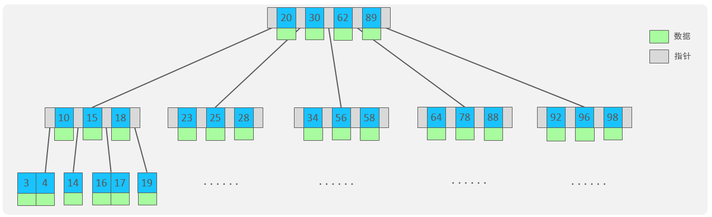

5阶的B树，每一个节点最多存储4个key，对应5个指针。 一旦节点存储的key数量到达5，就会裂变，中间元素向上分裂。 在B树中，非叶子节点和叶子节点都会存放数据。结合叶子结点和非叶子结点才能构成完整的数据，每一个几点就是一个**页**（InnoDB 最小控制单位）


**B+树**

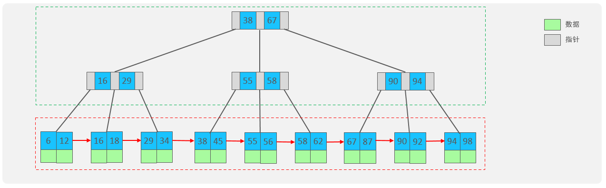

在B树上进行改进：

1. 非叶子节点不存储数据，只存储索引 用来当做目录  加快检索能力。所有数据都可以在叶子节点找到，叶子节点形成一个**双向链表**。
2. 在裂变时中间元素向上裂变  但是原节点仍包含中间元素。


**为什么选择 B+Tree**？

- **高扇出性：** 非叶子节点不存储实际数据，只存储键值和指针，使得一个节点可以容纳非常多的指针（子节点）。这大大降低了树的高度（通常只有 3-4 层），意味着查找任何数据通常只需要 3-4 次磁盘 I/O（假设节点大小与磁盘页匹配）。
- **稳定的查询效率：** 任何查询都需要从根节点遍历到叶子节点，路径长度相同（树的高度），查询效率稳定。
- **卓越的范围查询性能：** 叶子节点有序且通过链表连接，使得范围查询（WHERE col BETWEEN a AND b）异常高效，只需定位到起始点然后顺序遍历链表即可。
- **全表扫描优化：** 遍历链表就能按索引顺序获取所有数据（对于聚簇索引就是所有行数据），比遍历无序的数据页快得多。
- **更适合磁盘存储：** 节点大小通常设计为磁盘页大小（如 16KB）的倍数，能最大化利用磁盘 I/O 的块读取特性，减少随机 I/O。


那么正常一棵B+树可以存**储多少数据**呢？我们来算一下

一个页的大小是**16K** 

假设： 一行数据大小为1k，一页中可以存储16行这样的数据。InnoDB的指针占用6 个字节的空间，主键即使为bigint，占用字节数为8 。

**高度为2**:    n * 8+ (n+1)  * 6 = 16 * 1024 ，算出n约为 1170      1171 * 16 = 18736 

**高度为3**： 1171* 1171 * 16 = 21939856  **大约两千万条数据**


## 2. 索引的分类

索引按照**物理层**可分为**聚簇索引**、**二级索引（非聚簇索引）**

1. **聚簇索引（Clustered Index）：**
   1. 表数据行的物理存储顺序与索引的逻辑顺序相同。一个表**有且只有一个**聚簇索引。
   2. InnoDB 的实现：
      - 如果定义了主键（PRIMARY KEY），主键索引就是聚簇索引。
      - 如果没有显式定义主键，则选择第一个具有唯一非空约束（UNIQUE NOT NULL）的列作为聚簇索引。
      - 如果以上都没有，InnoDB 会隐式创建一个隐藏的 RowID 作为聚簇索引。
   3. **特点**：
      - 叶子节点存储完整数据行。按主键查询极快（一次索引查找即得数据）。
      - 范围查询（按主键范围）高效。
      - 插入速度依赖于插入顺序（按主键顺序插入最快，避免页分裂）。
      - 更新主键代价高（会导致行移动）。

2. **二级索引（Secondary Index / Non-Clustered Index / 辅助索引）：**
   - 除了聚簇索引以外的所有索引都是二级索引。
   - InnoDB 的实现： 叶子节点存储该索引的**键值**和对应行的**主键值**。
   - **查询过程（回表）：** 使用二级索引查询时，先在二级索引树中找到目标键值和对应的主键值，然后拿着这个主键值回到聚簇索引树中查找完整的行数据。这个“回表”操作会产生额外的 I/O。
   - **特点：**
     - 叶子节点不包含完整数据，需要回表。
     - 查询效率通常低于直接使用聚簇索引（因为有回表开销）。
     - 覆盖索引可以避免回表（见下文）。

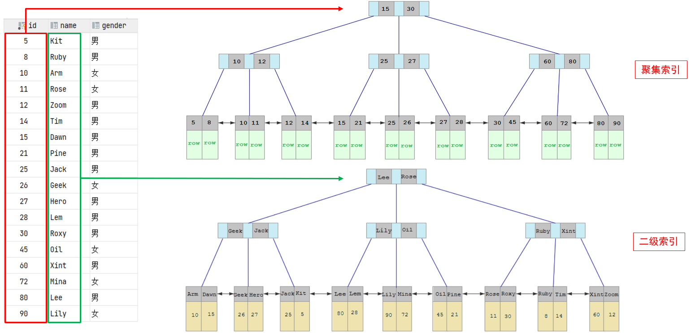


按照**字段**来分索引的话  又可以分为

- **主键索引（PRIMARY KEY）：**

  - 特殊的唯一索引。每个表只能有一个。
  - 强制要求索引键值唯一且非空（NOT NULL）。
  - 在 InnoDB 中，它就是聚簇索引。
  - 是逻辑行（Row）的唯一标识。

- **唯一索引（UNIQUE INDEX）：**

  - 强制要求索引键值**唯一**。允许有 NULL 值（但通常只能有一个 NULL，具体行为取决于数据库设置和版本）。
  - 用于保证数据唯一性约束。
  - 可以是聚簇索引（如果它是主键）或二级索引。

- **普通索引（INDEX / KEY）：**

  - 最基本的索引类型，没有任何唯一性约束。
  - 纯粹为了加速查询。
  - 只能是二级索引。

- **Full-Text Index（全文索引）：**

  - 结构： 专门为文本内容搜索（MATCH ... AGAINST）设计。早期 MyISAM 支持，现在 InnoDB 也支持。底层通常使用倒排索引（Inverted Index），记录单词到文档（行）的映射。
  - 特点： 支持自然语言搜索、布尔搜索、相关性排序等。

- **R-Tree（空间索引）：**

  - 结构： 用于存储和查询空间数据（如地理位置 GEOMETRY）。
  - 特点： 支持快速查找包含某个点、与某个形状相交或在某个区域内的对象。
  - 引擎： MyISAM 和 InnoDB（MySQL 5.7+）支持。

- **联合索引（Composite Index / Compound Index）：**

  - 基于**多个列**组合创建的索引。
  - 索引键值由多个列的值按定义顺序连接组成（如 `(col1, col2, col3)`）。
  - **最左前缀匹配原则：** 这是联合索引查询有效性的核心规则。查询条件必须**包含索引定义中最左边的列**（或连续的最左前列组合），索引才能被有效使用。
    - 索引 `(A, B, C)` 能有效用于 `WHERE A=...`, `WHERE A=... AND B=...`, `WHERE A=... AND B=... AND C=...`, `WHERE A=... AND C=...`（C 条件可能无法完全利用，但 A 能定位范围）。
    - 索引 `(A, B, C)` **不能**有效用于 `WHERE B=...`, `WHERE C=...`, `WHERE B=... AND C=...`（因为缺少最左列 A）。
  - 联合索引可以避免为多个单列索引创建多个索引结构，有时还能实现覆盖索引。

  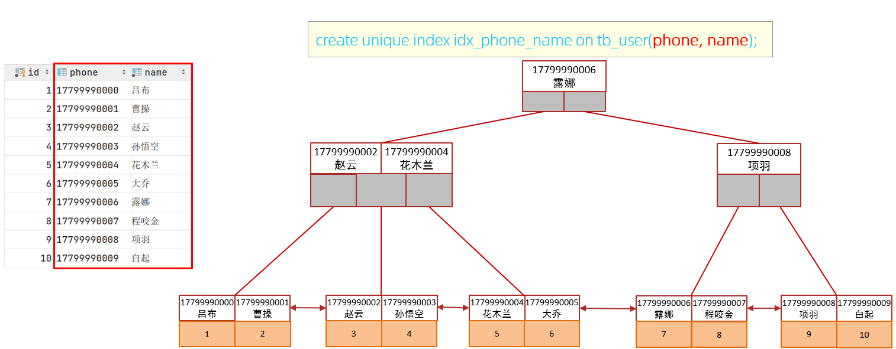

- **前缀索引（Prefix Index）：**

  - 对于很长的字符列（如 VARCHAR(255)），可以为该列的前 N 个字符创建索引，而不是整个列。
  - 目的： 节省索引存储空间和提高索引效率（比较更短的字符串更快）。
  - 缺点**：**
    - 降低了索引的选择性（区分度），可能导致查询需要扫描更多行。
    - 无法用于 `ORDER BY` 或 `GROUP BY`（除非显式指定前缀长度 `ORDER BY col_name(20)`，但这不常见）。
    - 无法用于覆盖索引（除非 SELECT 的列刚好也是前缀）。
  - 创建： `CREATE INDEX idx_name ON table_name (column_name(N));`

  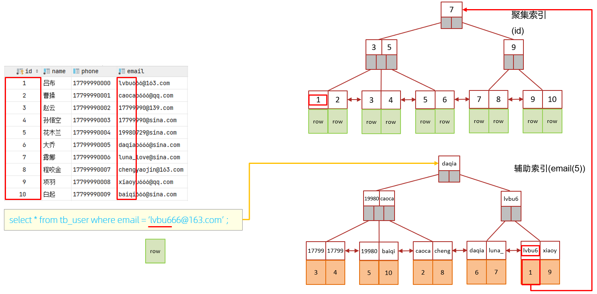

- **自适应哈希索引（Adaptive Hash Index - AHI）：**
  - **InnoDB 特有特性。**
  - 数据库**内部自动创建和维护**的基于内存的哈希索引。
  - 它**监控**对 B+Tree 索引页的频繁访问模式。如果一个索引页被非常频繁地以相同模式（通常是等值查询）访问，InnoDB 会在内存中为该页构建一个哈希索引，以加速后续对该页的访问。
  - 用户不可控： DBA 无法显式创建或删除 AHI。可以通过参数 `innodb_adaptive_hash_index` 开启或关闭。
  - 优点：对特定热点数据的等值查询有显著加速效果。
  - 缺点： 占用内存；在高并发写场景下可能成为瓶颈（维护哈希结构的锁竞争）。

## 3. 索引的特征

### 3.1 回表

什么回表呢？

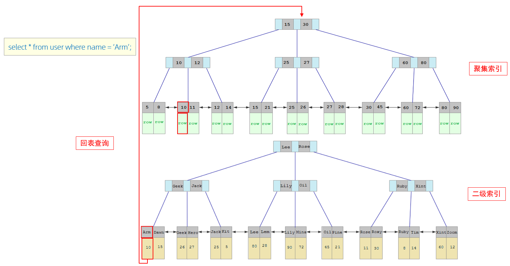

**回表原因**：因为在语句查询时如果使用的是非聚簇索引，那么其叶子结点的数据是不全的  就需要从非聚簇索引的叶子结点拿到聚簇索引的索引值（聚簇索引拥有全数据）然后去聚簇索引再次进行查询  拿到该条数据的全部数据。

**执行流程**：

1. 由于是根据name字段进行查询，所以先根据name='Arm'到name字段的二级索引中进行匹配查找。但是在二级索引中只能查找到 Arm 对应的主键值 10。
2. 由于查询返回的数据是*，所以此时，还需要根据主键值10，到聚集索引中查找10对应的记录，最 终找到10对应的行row。 

3. 最终拿到这一行的数据，直接返回即可。

> 回表查询： 这种先到二级索引中查找数据，找到主键值，然后再到聚集索引中根据主键值，获取 
>
> 数据的方式，就称之为回表查询。


### 3.2 索引覆盖 

覆盖索引：

- 指一个查询**只需要访问索引本身**就能获取到所需的全部数据列，**无需回表**（对于二级索引）或访问数据页（对于聚簇索引）。
- **如何实现：** SELECT 语句中查询的列都包含在某个索引（单列或联合索引）的键值中（对于二级索引，主键值总是包含的）。
- **巨大优势：** 极大地提升查询性能，因为只需要扫描索引树（通常更小、更紧凑），避免了昂贵的回表或数据页访问操作。
- 例如：索引 `(user_id, name)` 对于查询 `SELECT name FROM users WHERE user_id = 100;` 就是覆盖索引。


### 3.3 索引下推

索引下推：

- **解决的问题：** 在二级索引查询中，即使索引未能完全覆盖 WHERE 条件（部分条件涉及索引未包含的列），传统的做法是先在二级索引中找到所有匹配索引键值的行（得到主键），然后回表取出完整行数据，最后在 Server 层应用剩余的 WHERE 条件进行过滤。如果二级索引找到的行很多，但大部分都被剩余条件过滤掉了，回表操作就是巨大的浪费。
- **ICP 原理：** 将 WHERE 子句中**涉及索引列但无法在索引中完全评估**的条件（比如联合索引 `(A, B)` 中的 `B LIKE '%abc'` 或 `B > 10`，或者对索引列应用了函数但优化器能下推部分计算），**“下推”到存储引擎层去执行**。存储引擎在遍历二级索引时，会利用这些下推的条件**直接在索引层面进行初步过滤**，只将满足所有（可下推）索引条件的行对应的主键值回表去取数据。
- **巨大优势：** 显著减少了不必要的回表次数，提升了查询性能，特别是对于联合索引和包含 `LIKE`、范围查询等条件的查询。使用 `EXPLAIN` 查看执行计划，如果 `Extra` 列出现 `Using index condition`，就表示使用了 ICP。

举例说明：

假设表`user`有联合索引`(a, b)`，执行以下查询：

```sql
SELECT * FROM user 
WHERE a = '1' 
AND b LIKE '%dudu%' 
AND c LIKE '%xiaowu%';
```

- **传统方式**：

- - 存储引擎利用`a`定位索引条目，获取所有`a='1'`的主键。
  - 回表查询所有对应数据行后，服务器层再过滤`b`和`c`条件。

- **索引下推**：

- - 存储引擎在扫描索引时，先根据`a` 将数据查询出来，然后直接应用`b LIKE '%dudu%'`条件进行过滤
  - 仅符合条件的索引条目对应的主键需要回表，返回给sever层，sever层再过滤`c`条件，完成数据筛选。

- **效果**：减少回表次数，避免读取无效数据。
- **为什么b的模糊查询能被下推？**

- - 虽然`b LIKE '%dudu%'`是模糊匹配，但只要b字段在索引中，存储引擎就能直接通过索引内容进行过滤（即使无法利用索引的有序性）


### 3.4 最左匹配原则

在联合索引中，查询条件必须包含索引的最左列，且遵循从左到右的连续顺序。若跳过左列或顺序不连续，索引将部分失效或完全失效。这是怎么回事？

**联合索引存储结构**：联合索引按列顺序构建 B+ 树。例如索引 `(a, b, c)`，数据先按 `a` 排序，`a` 相同则按 `b` 排序，`b` 相同再按 `c` 排序。所以说如果查询时最左边第一个索引都没有命中话  则无法命中索引

查询逻辑：只有从左开始连续匹配，才能利用索引的有序性快速定位数据。跳过左列会导致无法利用索引结构。

举个**栗子**吧：

假设表 user 有联合索引 (a, b, c)，不同查询条件的索引使用情况如下：

1. **有效匹配索引**

   - 查询条件：WHERE a = 1 AND b = 2

      结果：索引生效，同时使用 a 和 b 两列。

   - 查询条件：WHERE a = 1 AND c = 3  

     结果：仅 a 生效，c 因跳过 b 无法使用索引。

2. **无效匹配索引**

   - 查询条件：WHERE b = 2 AND c = 3 

     结果：完全无法使用索引，触发全表扫描。

3. **范围查询的影响**

   - 查询条件：WHERE a = 1 AND b > 2 AND c = 3 

     结果：a 和 b 生效，c 因范围查询 b > 2 而失效。


## 4. 索引的失效场景

索引会在什么情况下失效呢？

1. **违反最左前缀原则：** 联合索引未使用最左列。

   **解决方案**：  

   - 调整查询条件顺序，确保联合索引最左列在条件中。  

   - 重构索引结构（如新增 `(b,c)` 索引）。

     

2. **对索引列进行计算或函数操作：** `WHERE YEAR(date_col) = 2023` (除非有函数索引) vs `WHERE date_col BETWEEN '2023-01-01' AND '2023-12-31'`。

   原因：索引存储原始值，计算或函数破坏索引的有序性，需全表扫描

   解决方案：  

   - 将运算移至等号右侧：WHERE age > 20-1。  
   - 使用持久化计算字段（如生成列）代替动态计算。

3. **对索引列使用隐式类型转换：**` WHERE phone = 13800138000`（phone为varchar类型）。

   原因：数据库需隐式转换类型，等效于对索引字段调用函数，导致失效[21] [25]。

   解决方案：

   - 统一数据类型：WHERE phone = '13800138000'。

4. **使用 != 或 <>：** 通常导致全表扫描（除非索引覆盖且优化器认为扫描索引比全表快）。

   解决方案：

   - 使用是>= 或者<=则不会失效

5. **使用 LIKE 以通配符 % 开头：** `WHERE name LIKE '%abc'`。`'abc%'` 通常可以利用索引。

   原因：B+树索引基于前缀匹配，无法定位不确定前缀的字符串

   解决方案：

   - 使用后置模糊匹配`abc%`

6. **OR 条件未覆盖所有相关列：** 如果 OR 连接的条件没有都覆盖索引，可能导致不使用索引。`WHERE a=1 OR b=2`，且 b 列无索引。

   原因：OR条件若涉及非索引列，优化器无法有效合并结果，转为全表扫描

   解决方案：

   - 拆分为UNION查询：`SELECT * FROM t WHERE a=1 UNION SELECT * FROM t WHERE b=2`。  
   - 为所有OR涉及的列单独建立索引。

7. **索引列存在 NULL 值：** 如果列允许 NULL，`WHERE col IS NULL` 可能（但不一定）利用索引，取决于优化器选择。`WHERE col IS NOT NULL` 通常效率较低。

8. **数据倾斜严重：** 当某个值占比过高时，优化器可能认为全表扫描比索引扫描更快。


## 5. 索引的设计与优化

### 5.1 索引的创建

1. **为查询创建索引：** 索引不是为表创建的，而是为**频繁执行且性能关键的查询**创建的。分析慢查询日志（Slow Query Log）是识别需要索引的查询的关键。

2. **选择合适的列：**
   - 针对于数据量较大，且查询比较频繁的表建立索引。
   - 查询条件（where）、排序（order by）、分组（group by）`WHERE`、`JOIN ON`、`ORDER BY`、`GROUP BY` 子句中频繁出现的列。
   - 考虑创建**联合索引**代替多个单列索引，并**严格遵守最左前缀原则**设计索引列顺序（将最常用于等值过滤和高选择性的列放左边；范围查询列放右边）。

4. 如果索引列不能存储NULL值，请在创建表时使用NOT NULL约束它。当优化器知道每列是否包含 NULL值时，它可以更好地确定哪个索引最有效地用于查询。
5. 要控制索引的数量，**索引并不是多多益善**，索引越多，维护索引结构的代价也就越大，会影响增 删改的效率。


### 5.2 SQL优化

**批量插入数据**

- 如果一次性需要插入大批量数据(比如: 几百万的记录)，使用insert语句插入性能较低，此时可以使 用MySQL数据库提供的load指令进行插入。

- **页分裂**  页是数据库的最小控制单位  在数据插入时如果数据是乱序的  从中间插入数据时如果页大小不够了则会新开一个页将相邻数据页50%分隔开 和该数据组合进入新的数据页  然后数据页的双向链表指向该数据页

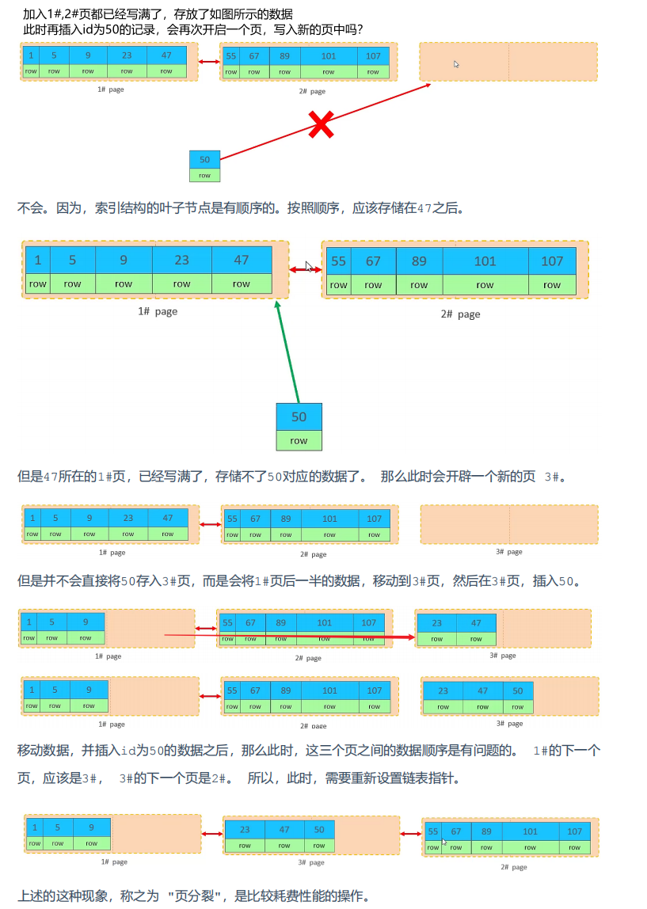


- **页合并**  当一个页中的数据删除了50%（可配置  默认50%）时会查找相邻的页的数据 如果有能够融合成一页的就会进行合并

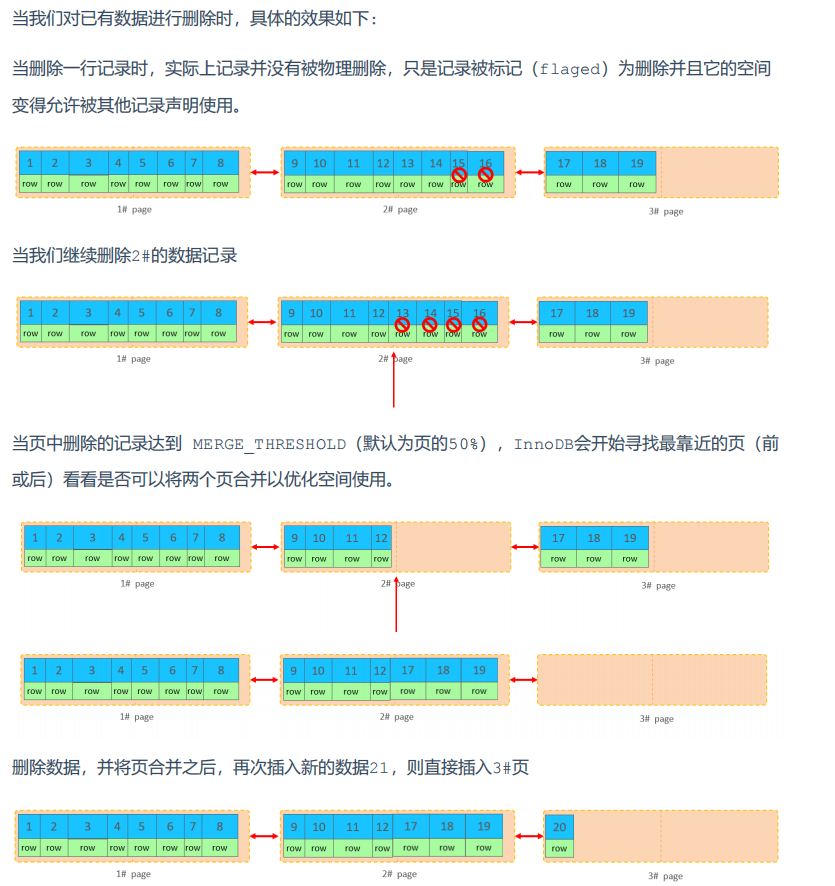


# 事务与锁

## 1. 锁的分类

**目的：** 保证**数据一致性**（Consistency）和**事务隔离性**（Isolation）。当多个事务同时访问（读取或修改）相同数据时，锁机制防止出现脏读、不可重复读、幻读等问题，确保最终结果是正确的。

 按照按锁的**模式（访问级别）** 划分（最核心）可分为： **共享锁（Shared Lock, S Lock）**和**排他锁（Exclusive Lock, X Lock）**


按锁的**粒度（锁定范围）** 划分 可分为 ：**表级锁（Table-Level Lock）**、**行级锁（Row-Level Lock）**、**页级锁（Page-Level Lock）**、**全局锁（Global Lock）**


### 1.1 共享锁和排他锁

- **共享锁（Shared Lock, S Lock）：**
  - 目的： 用于**读取**操作。
  - **兼容性：** 多个事务可以**同时**持有同一数据资源上的 S 锁（读读兼容）。
  - **排斥性：** 如果某个事务持有 S 锁，其他事务**不能**获得该资源上的 X 锁（读写不兼容）。
  - 加锁语句： 默认的 `SELECT` 语句**不加** S 锁（使用 MVCC）。显式加 S 锁使用 `SELECT ... LOCK IN SHARE MODE` (旧语法) 或 `SELECT ... FOR SHARE` (MySQL 8.0+ 推荐语法)。
- **排他锁（Exclusive Lock, X Lock）：**
  - 目的： 用于**写入**操作（INSERT, UPDATE, DELETE）。
  - **兼容性：** **最不兼容**的锁。如果一个事务持有 X 锁，其他事务**不能**获得该资源上的 **任何** 锁（S 或 X）（写写、读写都不兼容）。
  - 加锁语句： `INSERT`, `UPDATE`, `DELETE` 语句在操作数据行时会**自动**加 X 锁。显式加 X 锁使用 `SELECT ... FOR UPDATE`。


### 1.2 全局锁

- `FLUSH TABLES WITH READ LOCK (FTWRL)`： 加全局读锁。使整个数据库实例处于只读状态。用于备份等场景。阻塞所有写操作和大部分 DDL。非常重量级。
- `set global read_only=1`： 设置只读模式。比 FTWRL 轻量，但可能被具有 SUPER 权限的用户绕过。

全局锁是针对整个数据库而言的，从名称我们也能了解到大概意思，当我们对数据库加了全局读锁之后，那么其他任何对请求都不能对数据库再加写锁了，当我们对数据加了写锁后，那么后续对数据的加读锁和写锁的请求都会被阻塞。

全局锁只有在进行**主从备份数据**、或者**导入导出数据**的时候才会对全局进行加锁。

为什么需要全局锁?

因为我们在做备份数据或者导入导出数据操作的时候，如果这个系统期间还可以进行数据的增、删、改，那么就会有一个数据“时点性”问题，会导致数据不一致。

比如一个事务要修改学生表和学生选修课表。由于我们之前已经备份过学生表了，这时候插入两张表的数据，我们只能备份到选修课表的新数据，对于学生表的老数据就看不到了，造成不一致。

这个例子按照正常思维会很疑惑，我们可以改隔离级别，做到可重复读的级别，这样别的事务就不会影响到我们读取了。是这样的，但是很多存储引擎是没有mvcc的，为了避免数据插入，只能上表锁，全局锁。


### 1.3 元数据锁（DML）

MDL （meta data lock）其实也可以算表锁，之所以拆开聊，是因为它是Server层的锁，在MySQL5.5版本引入了MDL。

当对一个表做**增删改查操作**的时候，加MDL读锁；

当要对表做**结构变更操作DDL**的时候，加MDL写锁。

MDL不需要我们显式使用，在访问一个表的时候会被自动加上。MDL的作用是，保证读写的正确性。如果一个查询正在遍历一个表中的数据，而执行期间另一个线程对这个表结构做了变更，删了一列，那么查询线程拿到的结果跟表结构对不上，肯定不行

读锁之间不互斥，因此可以有多个线程同时对一张表增删改查

读写锁之间、写锁之间是互斥的，用来保证变更表结构操作的安全性。

举个栗子：

```sql
#1.开启事务，查询 对MDL加读锁
						 #2.修改表名，尝试加MDL写锁，排队
													#3.尝试获取MDL读锁，但是依然排队
#4.提交事务，释放MDL读锁
```


### 1.4 表锁

- 锁定范围： 整个表。
- **优点：** 实现简单，加锁/解锁开销小。
- **缺点：** 并发度最低。一个事务锁表后，其他访问该表的事务都会被阻塞。
- 类型：
  - **表级共享锁（S）：** `LOCK TABLES table_name READ;` 手动加。允许其他读，阻塞写。
  - **表级排他锁（X）：** `LOCK TABLES table_name WRITE;` 手动加。阻塞其他所有读写。
  - **意向锁（Intention Lock）：** **InnoDB 特有且关键**的**表级锁**，用于**协调**行锁与表锁的关系。它**表明**一个事务**打算**在表中的某些行上加什么类型的锁（行级 S 或 X 锁）。
    - **意向共享锁（Intention Shared Lock, IS）：** 事务**打算**给表中的某些行加 S 锁。`SELECT ... FOR SHARE` 会先加 IS 锁。
    - **意向排他锁（Intention Exclusive Lock, IX）：** 事务**打算**给表中的某些行加 X 锁。`SELECT ... FOR UPDATE`, `INSERT`, `UPDATE`, `DELETE` 会先加 IX 锁。
  - **意向锁的兼容性：**
    - IS 与 IS 兼容
    - IS 与 IX 兼容
    - IX 与 IX 兼容
    - **表级 S 锁**： 与 IS 兼容，**与 IX 不兼容**。
    - **表级 X 锁**： **与 IS 和 IX 都不兼容**。

| 锁类型 \ 兼容性     | 共享锁 (S) | 排他锁 (X) | 意向共享锁 (IS) | 意向排他锁 (IX) |
| ------------------- | ---------- | ---------- | --------------- | --------------- |
| **共享锁 (S)**      | 兼容       | 冲突       | 兼容            | 冲突            |
| **排他锁 (X)**      | 冲突       | 冲突       | 冲突            | 冲突            |
| **意向共享锁 (IS)** | 兼容       | 冲突       | 兼容            | 兼容            |
| **意向排他锁 (IX)** | 冲突       | 冲突       | 兼容            | 兼容            |


#### 1.4.1 意向锁

意向锁理解：假设事务 A 持有表 T 中某行的 X 锁（意味着它持有 T 的 IX 锁）。事务 B 想给整个表 T 加 S 锁。如果没有意向锁，B 需要扫描所有行检查是否有行锁冲突，效率极低。有了意向锁，B 发现 T 上已有 IX 锁（表示有事务持有或将要持有行级 X 锁），而 IX 与表级 S 锁不兼容，因此 B 会立即阻塞，无需扫描行。

总结就是  当一个事务要对表中的某一行加行级锁时，会先在表上加对应的意向锁。其他事务想对表**加表级锁**时，只要检查到有意向锁，就知道表中已经有行被加锁了，就不用全表扫描来判断啦


#### 1.4.2 自增锁

当你创建一张表给主键列设置了自增id INT NOT NULL AUTO_INCREMENT,那么插入的时候我们就不需要指定id了，它会自动添加自增的值。实现并发安全获取自增id有两种方式，和系统变量innodb_autoinc_lock_mode有关。
首先insert大致上可以分成三类：

innodb_autoinc_lock_mode` 变量一共有三个不同的取值：

**0**：这个表示 traditional，在这种模式下，都是在插入 SQL 语句开始的时候，获取到一个表级的 AUTO-INC 锁（虽然是表级锁，但只是为了对不同行的插入保证线程安全，和IS,IX,S,X这些锁是不冲突的），然后当插入 SQL 执行完毕之后，再释放掉这把锁，这样做的好处是可以确保在批量插入的时候，自增主键是连续的。它和传统锁不同的是，传统锁在事务结束后才释放，而它是在insert语句执行后立马就释放锁。

**2**: 这个表示 interleaved，在这种模式下，不存在 AUTO-INC 锁而是有一个轻量级的锁， 在为插入语句生成 AUTO_INCREMENT 修饰的列的值时获取一下这个轻量级锁， 然后获取到自增值。两个锁的区别在于，会不会和表锁相冲突。批量插入的时候，就有可能出现主键虽然自增，但是不连续的问题。
从上面的介绍中小伙伴们可以看到，实际上第三种，也就是 innodb_autoinc_lock_mode 取值为 2 的情况下，并发效率是最强的，那么我们是不是就应该设置 innodb_autoinc_lock_mode=2 呢？这得看情况。

之前介绍过MySQL binlog 日志文件的三种格式：

- row：binlog 中记录的是具体的值而不是原始的 SQL，举一个简单例子，假设表中有一个字段是 UUID，用户执行的 SQL 是 insert into user(username,uuid) values('javaboy',uuid())，那么最终记录到 binlog 中的 SQL 是 insert into user(username,uuid) values('javaboy',‘0212cfa0-de06-11ed-a026-0242ac110004’)。
- statement：binlog 中记录的就是原始的 SQL 了，以 row 中的为例，最终 binlog 中记录的就是 insert into user(username,uuid) values('javaboy',uuid())。
- mixed：在这种模式下，MySQL 会根据具体的 SQL 语句来决定日志的形式，也就是在 statement 和 row 之间选择一种。

对于这三种不同的模式，很明显，在主从复制的时候，statement 模式可能会导致主从数据不一致，所以现在 

MySQL 默认的 binlog 格式都是 row。
因为statement主从用的是原始语句，如果 innodb_autoinc_lock_mode 的值为 2，可能会导致不同事务中插入语句获取到的值是不同的。

我们可以查看下自己数据库的值是多少。SHOW VARIABLES LIKE 'innodb_autoinc_lock_mode';


### 1.5 行锁

行级锁定最大的特点就是锁定对象的颗粒度很小，由于锁定颗粒度很小，所以发生锁定资源争用的概率也最小，能够给予应用程序尽可能大的并发处理能力而提高一些需要高并发应用系统的整体性能。

虽然能够在并发处理能力上面有较大的优势，但是行级锁定也因此带来了不少弊端。

由于锁定资源的颗粒度很小，所以每次获取锁和释放锁需要做的事情也更多，带来的消耗自然也就更大了。此外，行级锁定也最容易发生死锁

**行级锁，是加在索引上的**，如果没有命中索引，会锁整个表吗？这个其实是个误区，没有命中索引，有可能会锁表，但是这个锁表和表锁没有任何关系，只是没命中索引就会在聚簇索引一条条找过去，查询经过的每一条记录都会被加锁，因此感觉上像是锁了表。

行级锁也分为共享锁S和排他锁X。插入语句加插入意向锁，删改语句加排他锁，查询语句默认不加锁。可以通过。`SELECT ... FOR UPDATE;SELECT ... LOCK IN SHARE MODE`;来对查询语句加X锁或者S锁。


行锁又分为：**记录锁（Record Lock）**、**间隙锁（Gap Lock）**、**临键锁（Next-Key Lock）**、**插入意向锁（Insert Intention Lock）**


#### 1.5.1 锁的结构

假设事务T1在表users的索引idx_age上对页号5的行加记录锁（X锁），其内存结构如下：

```txt
type_mode   = 0x80000003 (高24位:LOCK_ORDINARY | 中4位:LOCK_REC | 低4位:LOCK_X)
trx         = 0x7f8a3c00 (事务T1的地址)
index       = 0x7f8a4d00 (idx_age索引的地址)
hash_key    = {space_id=128, page_no=5, n_bits=64}
lock_bitmap = 0x00000001 (第1行被锁定)
```

InnoDB的锁结构通过`type_mode`字段（32位无符号整型）集中管理锁模式和类型，其位分配规则如下：

```plain
| 31-8 bits (24位) | 7-4 bits (4位) | 3-0 bits (4位) |
| -----------------| -------------- | -------------- |
| 行锁类型          | 锁级别          | 锁模式          |
```

1. **锁模式**（Lock Mode）：低4位

   存储内容：表示锁的基本操作类型。

   取值范围：

   - `0x0` (LOCK_IS)：意向共享锁（表级）。

   - `0x1` (LOCK_IX)：意向排他锁（表级）。
   - `0x2` (LOCK_S)：行级共享锁。
   - `0x3` (LOCK_X)：行级排他锁。
   - `0x4` (LOCK_AUTO_INC)：自增锁。

   作用：决定锁的读写权限和兼容性。

2. **锁级别**（Lock Level）：5-8位（4位）

   存储内容：标识锁的粒度级别。

   取值：

   - `0x10` (LOCK_TABLE)：表级锁。
   - `0x20` (LOCK_REC)：行级锁。

   作用：区分锁是作用在表还是行。

3. **行锁类型**（Record Lock Type）：高位24位

   存储内容：行锁的具体类型。

   取值：

   - `0x10000000` (LOCK_WAIT)：等待状态。

   - `0x20000000` (LOCK_REC_NOT_GAP)：记录锁（非间隙）。

   - `0x40000000` (LOCK_GAP)：间隙锁。

   - `0x80000000` (LOCK_ORDINARY)：临键锁（Next-Key Lock）。

   作用：控制行锁的范围（如间隙、记录本身或组合）。


#### 1.5.2 记录锁（Record Lock）

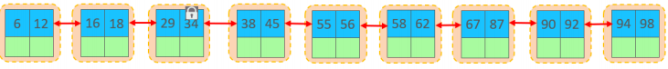

- 锁定索引记录本身。
- 总是锁定**索引项**（即使表没有显式索引，InnoDB 也会创建一个隐藏的聚簇索引）。
- `SELECT ... FOR UPDATE`, `UPDATE`, `DELETE` 在精确匹配到唯一索引（包括主键）的等值查询时，通常加记录锁（X 模式）。
- 例如：`DELETE FROM users WHERE id = 10;` (id 是主键) -> 对 id=10 的记录加 X 记录锁。

行锁都是锁在索引上的，如果要锁的列没有索引，会进行全表记录加锁。如果锁的是二级索引，那么一般情况下都是**先锁二级索引再锁聚簇索引**

针对唯一索引进行检索时，对已存在的记录进行等值匹配时，将会自动优化为行锁。 InnoDB的行锁是针对于索引加的锁，不通过索引条件检索数据，那么InnoDB将对表中的所有记录加锁，此时 就会**升级为表锁**。


#### 1.5.3 间隙锁（Gap Lock）

锁定**索引记录之间的间隙**，或者第一个索引记录之前或最后一个索引记录之后的“间隙”。

**目的**：**防止幻读**（Phantom Read），确保在同一个事务内多次执行相同的范围查询会得到一致的结果集（阻止其他事务在间隙中插入新记录）。

**仅存在于 REPEATABLE READ (RR) 隔离级别**。`READ COMMITTED` (RC) 级别下通常**不**使用间隙锁。

间隙锁之间**不冲突**。不同事务可以在同一个间隙上加间隙锁（因为它们都是为了防止插入，而阻止插入这个动作本身不冲突）。

**举例**：`SELECT * FROM users WHERE age BETWEEN 20 AND 30 FOR UPDATE;` (RR 级别) -> 除了锁定 age 在 20-30 之间的所有记录（X 记录锁），还会锁定 (min_age, 20) 和 (30, max_age) 这两个间隙（X 间隙锁），阻止其他事务插入 age=19, 21, 29, 31 等在这个范围内的新记录。

锁定索引记录间隙（不含该记录），确保索引记录间隙不变，防止其他事务在这个间隙进行insert，产生幻读。在RR隔离级别下都支持。

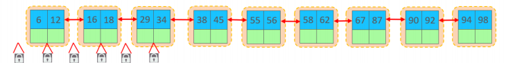

举例：假如说现在要更新 id = 13的数据  那么就会对12 -- 16 之间的间隙加锁。只锁间隙不锁两边数据 也是是开区间


#### 1.5.4 临键锁

默认情况下，InnoDB在 REPEATABLE READ事务隔离级别运行，InnoDB使用 next-key 锁进行搜索和索引扫描，以防止幻读。

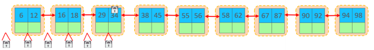

临建锁（next-key）= **记录锁 + 间隙锁**，它既能保护该条记录，又能阻止别的事务 将新记录插入被保护记录前边的 间隙 。临键锁是innodb的最基本的锁单位，只是在某些情况下会退化成记录锁或者间隙锁。

在加锁的时候，我们都是对记录加锁，如果是间隙锁，我们也是对开区间的最后一条记录上加上一把锁。所以我们在插入记录时，我们也需要判断这个插入区间往后的第一条记录上的锁情况。

锁定一个**索引记录**以及**该记录之前的间隙**。即锁定一个**左开右闭**的区间 `(previous_gap, current_record]`。

**目的**：结合记录锁和间隙锁的功能，**既防止当前记录被修改/删除，也防止在记录前的间隙中插入新记录（防止幻读）**。


#### 1.5.5 插入意向锁

插入意向锁本质其实就只是个gap锁，用来解决当前读的幻读问题。插入意向锁不会阻塞其他行锁，但是gap行锁无论S还是X都会阻塞插入意向锁。

**目的**： 表示一个事务**打算**在某个间隙中**插入**新记录。它**不会阻塞**其他事务在**同一个间隙**上加间隙锁（因为间隙锁本身就是为了防止插入，允许多个事务“声明”要防止插入是合理的），但会**与已有的间隙锁/临键锁冲突**（即如果已经有事务在该间隙上加了间隙锁/临键锁来防止插入，那么插入意向锁会等待）。

**作用**： 提高并发插入性能。多个事务只要不是插入到**完全相同的位置**（相同的间隙和相同的插入值可能导致唯一键冲突），即使它们要在同一个间隙插入，只要没有其他事务持有该间隙的锁阻止插入，它们都可以获得插入意向锁并执行插入。它**通知**其他事务“我想在这里插个值，如果你们没意见（没有阻塞我的锁）我就插了”。

例如：事务 A 持有间隙锁锁定 (5, 10)。事务 B 想插入 id=7。事务 B 在插入前会尝试获取 (5, 10) 间隙上的**插入意向锁**。因为事务 A 已经在该间隙上持有（排他）间隙锁，事务 B 的插入意向锁请求会**阻塞**，直到事务 A 释放间隙锁。


## 2. 加锁原则

1. **索引上的等值查询(唯一索引)，给不存在的记录加锁时, 优化为间隙锁 。**

2. **索引上的等值查询(非唯一普通索引)，向右遍历时最后一个值不满足查询需求时，next-key lock 退化为间隙锁。** 

3. **索引上的范围查询(唯一索引)  会访问到不满足条件的第一个值为止。**
4. **查找过程中访问到的对象才会加锁**


> 注意：间隙锁唯一目的是防止其他事务插入间隙。间隙锁可以共存，一个事务采用的间隙锁不会 
>
> 阻止另一个事务在同一间隙上采用间隙锁。


例：

| id   | age  |
| ---- | ---- |
| 1    | 3    |
| 3    | 5    |
| 4    | 5    |
| 7    | 9    |

1. 执行sql  `update user set age = 10 where id = 5 ` 锁是如何加的呢
   1. 首先默认临键锁会对（4 , 7]进行加锁，
   2. 然后根据原则1 会优化成间隙锁  最终加锁范围id（4,7）
2. 执行sql  `select  * from user where age = 5`  锁是如何加的呢
   1. 首先会索引会定位到第一条age为5的数据进行临键锁加锁  (3 , 5]
   2. 然后继续向右遍历 找到第二个5 继续向右遍历找到 9 加锁 (5 , 9]
   3. 根据原则2 对最后一个值9 不满足查询条件  退化为间隙锁 所以最终加速范围（3 ，9）
3. 执行sql  `select * from user where age > 5`  锁是如何加的呢
   1. 首先找到5以后往右遍历 进行加锁 （5 , 9] 
   2. 根据原则3  找到最后一个不满足条件的 但是最后是9 再往后没有的，这时候会加一个到正无穷的锁也就是说最终加锁（5 ，+无穷）
4. 执行sql  `select age from user where age = 5`   的过程中  执行 `update user set age = 10 where id = 5`
   1. 首先和上面分析的一样 会把二级索引的区间（3 ，9）锁住，但是更新语句仍然会成功
   2. 这是为啥 根据原则4 因为覆盖索引不需要回表  那么主键索引没有锁  仍然可以更新


## 3. 事务

### 3.1 事务的四大特性

- 原子性(Atomicity)：事务是数据库的逻辑工作单位，事务中包含的各操作要么都做，要么都不做。 undolog来保证
- 一致性(Consistency)：事务开始前和结束后，数据库的完整性约束没有被破坏 。比如A向B转账，不可能A扣了钱，B却没收到。
- 隔离型(Isolation)：一个事务的执行不能被其它事务干扰。即一个事务内部的操作及使用的数据对其它并发事务是隔离的，并发执行的各个事务之间不能互相干扰。mvcc和锁来保证
- 持久性(Durability)：指一个事务一旦提交，它对数据库中的数据的改变就应该是永久性的。接下来的其它操作或故障不应该对其执行结果有任何影响。redolog 来保证


### 3.2 事务的隔离级别

首先介绍几个概念：

1. 脏读：事务A读取了事务B更新的数据，然后B回滚操作，那么A读取到的数据是脏数据

2. 不可重复读：事务 A 多次读取同一数据，事务 B 在事务A多次读取的过程中，对数据作了更新并提交，导致事务A多次读取同一数据时，结果 不一致。

3. 幻读：系统管理员A将数据库中所有学生的成绩从具体分数改为ABCDE等级，但是系统管理员B就在这个时候插入了一条具体分数的记录，当系统管理员A改结束后发现还有一条记录没有改过来，就好像发生了幻觉一样，这就叫幻读。

   小结：不可重复读的和幻读很容易混淆，不可重复读侧重于修改，幻读侧重于新增或删除。


| 隔离级别                      | 脏读 (Dirty Read) | 不可重复读 (Non-Repeatable Read) | 幻读 (Phantom Read)      |
| ----------------------------- | ----------------- | -------------------------------- | ------------------------ |
| `READ UNCOMMITTED` (读未提交) | 可能              | 可能                             | 可能                     |
| `READ COMMITTED` (读已提交)   | **不可能**        | 可能                             | 可能                     |
| `REPEATABLE READ` (可重复读)  | **不可能**        | **不可能**                       | 可能 (InnoDB **不可能**) |
| `SERIALIZABLE` (串行化)       | **不可能**        | **不可能**                       | **不可能**               |


### 3.3 MVCC

Multi Version Concurrency Control用来实现不加锁情况下的读一致性和隔离性。

MVCC的实现，基于**undolog**、**版本链**、**readview**。

**作用**：减少锁竞争，提高并发性能，尤其适用于读多写少场景

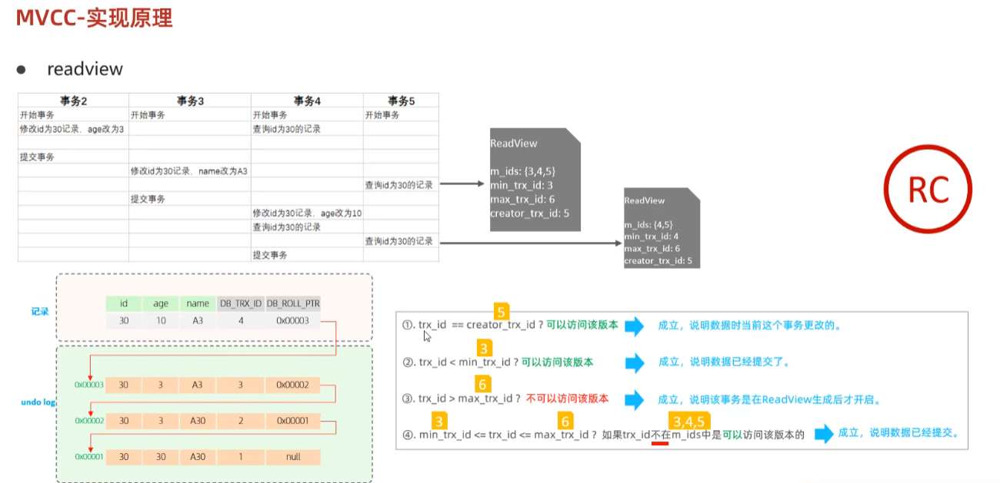


**工作流程 (读操作)：**

1. 当开启一个读事务（如 SELECT）时（根据隔离级别决定创建 Read View 的时机）。
2. 访问数据行时，获取该行当前的 `DB_TRX_ID（最近修改事务ID）`。
3. 根据当前事务的 **Read View** 和 **可见性判断规则**，判断该 `DB_TRX_ID` 对应的版本对当前事务是否可见。
4. 如果不可见，则通过该行的 `DB_ROLL_PTR` 找到 Undo Log 中的**历史版本**。
5. 重复步骤 3 和 4，沿着**版本链**向上查找，直到找到满足可见性规则的版本（或到达链尾）。
6. 返回找到的可见版本的数据。


**工作流程 (写操作 - UPDATE/DELETE)：**

- 写操作（增删改）总是基于**最新的已提交版本**进行。
- `UPDATE`：
  1. 定位要更新的行（使用当前读，可能加锁）。
  2. 将当前行的内容（最新已提交版本）拷贝到 Undo Log，形成旧版本，并设置 `DB_ROLL_PTR` 指向它。
  3. 更新当前行的数据，设置 `DB_TRX_ID` 为当前事务 ID。
  4. 将 `DB_ROLL_PTR` 指向刚刚创建的 Undo Log 记录。
- `DELETE`： 类似于 UPDATE，逻辑上标记为删除（设置 `DB_TRX_ID` 和 `DB_ROLL_PTR`），物理删除由 Purge 线程完成。
- `INSERT`： 新插入的行，其 `DB_TRX_ID` 为当前事务 ID，`DB_ROLL_PTR` 指向一个特殊的 Undo Log 记录（表示空）。


#### 3.3.1 undolog

回滚日志，在insert、update、delete的时候产生的便于数据回滚的日志。 

当insert的时候，产生的undo log日志只在回滚时需要，在事务提交后，可被立即删除。 

而update、delete的时候，产生的undo log日志不仅在回滚时需要，在快照读时也需要，**不会立即被删除**。


#### 3.3.2 版本链

在数据存储时除了正常要存入的数据还会存入三个隐藏字段：

| 隐藏字段    | 含义                                                         |
| ----------- | ------------------------------------------------------------ |
| DB_TRX_ID   | 最近修改事务ID，记录插入这条记录或最后一次修改该记录的事务ID。 |
| DB_ROLL_PTR | 回滚指针，指向这条记录的上一个版本，用于配合undo log，指向上一个版本。 |
| DB_ROW_ID   | 隐藏主键,如果表结构没有指定主键,将会生成该隐藏字段。         |

实际还有一个删除flag隐藏字段, 既记录被更新或删除并不代表真的删除，而是删除flag变了（假删除）

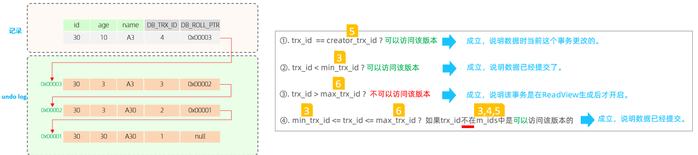

版本链是如何工作的呢：

每次更新操作，都会在 Undo Log 中生成一条记录，记录旧数据，新数据的 `DB_ROLL_PTR` 指向旧数据，再次更新新数据再指向旧数据，形成一条**单向链表**，即版本链。链头是最新版本，链尾是最旧版本。


#### 3.3.3 readview

ReadView（读视图）是 快照读 SQL执行时MVCC提取数据的依据，记录并维护系统当前活跃的事务（未提交的）id。

生成时机：

-  **RR**（可重复读）隔离级别下：**事务在启动时**会生成一个 Read View，这个 Read View 会在整个事务过程中保持不变，所以事务期间看到的数据都是一致的，可重复读嘛。
-  **RC**（读已提交）隔离级别中：**每次执行查询操作**时都会生成新的 Read View，这样就能读到其他事务提交的最新数据啦。

**关键内容 (快照信息)：**

- `m_ids`： 创建 Read View 时，系统中**活跃**（未提交）的事务 ID 列表。
- `min_trx_id`： `m_ids` 中的最小值。
- `max_trx_id`： 创建 Read View 时，系统应分配给**下一个事务**的 ID 值。
- `creator_trx_id`： 创建该 Read View 的事务自身的 ID（对于只读事务，默认为 0）。

**可见性判断规则：** 当访问一条记录时，检查该记录的 **DB_TRX_ID** (创建/修改它的事务ID)：

1. 如果 `DB_TRX_ID < min_trx_id`： 说明该记录版本在 Read View 创建**之前**就已提交，**可见**。
2. 如果 `DB_TRX_ID >= max_trx_id`： 说明该记录版本在 Read View 创建**之后**才被修改（由将来事务创建），**不可见**。
3. 如果 `min_trx_id <= DB_TRX_ID < max_trx_id`：
   - 如果 `DB_TRX_ID` **在** `m_ids` 列表中： 说明创建该版本的事务在创建 Read View 时**仍活跃**（未提交），该版本**不可见**。
   - 如果 `DB_TRX_ID` **不在** `m_ids` 列表中： 说明创建该版本的事务在创建 Read View 时**已提交**，该版本**可见**。
4. 如果 `DB_TRX_ID == creator_trx_id`： 该记录版本是当前事务自己修改的，**可见**。

5. **不可见怎么办？** 沿着记录的 **DB_ROLL_PTR** 指针，在 **Undo Log** 中找到该记录的**历史版本**，重新应用上述规则判断，直到找到满足条件的可见版本。


