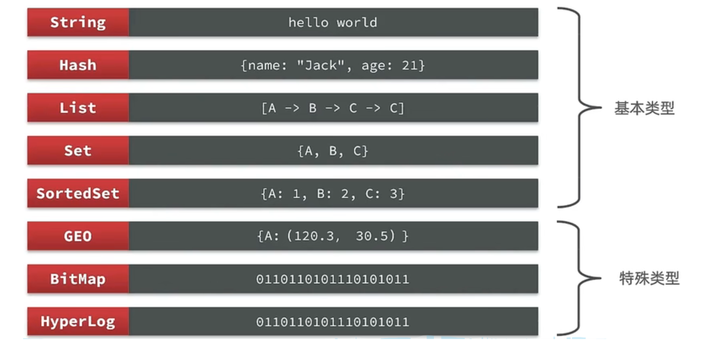
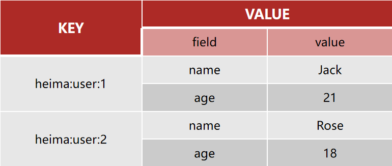

---
totail:
icon: book
date: 2023-10-01
category:
  - 编程
tag:
  - Redis
---

# Redis基础
基础打不牢，谈什么向上攀登！

<!-- more -->

## 1 Redis初始化

Redis诞生于2009年全称是**Re**mote  **D**ictionary **S**erver 远程词典服务器，是一个基于内存的键值型NoSQL数据库。

**特征**：

- 键值（key-value）型，value支持多种不同数据结构，功能丰富
- 单线程，每个命令具备原子性
- 低延迟，速度快（基于内存.IO多路复用.良好的编码）。
- 支持数据持久化
- 支持主从集群.分片集群
- 支持多语言客户端

**作者**：Antirez

Redis的官方网站地址：https://redis.io/

Redis是一种键值型的NoSql数据库，这里有两个关键字：

- 键值型
- NoSql

其中**键值型**，是指Redis中存储的数据都是以key.value对的形式存储，而value的形式多种多样，可以是字符串.数值.甚至json

而NoSql则是相对于传统关系型数据库而言，有很大差异的一种数据库。

对于存储的数据，没有类似Mysql那么严格的约束，比如唯一性，是否可以为null等等，所以我们把这种松散结构的数据库，称之为NoSQL数据库。

**NoSql**可以翻译做Not Only Sql（不仅仅是SQL），或者是No Sql（非Sql的）数据库。是相对于传统关系型数据库而言，有很大差异的一种特殊的数据库，因此也称之为**非关系型数据库**。

### 1.1 关系与非关系型数据库

除了上述四点以外，在存储方式.扩展性.查询性能上关系型与非关系型也都有着显著差异，总结如下：


- 存储方式
  - 关系型数据库基于磁盘进行存储，会有大量的磁盘IO，对性能有一定影响
  - 非关系型数据库，他们的操作更多的是依赖于内存来操作，内存的读写速度会非常快，性能自然会好一些

* 扩展性
  * 关系型数据库集群模式一般是主从，主从数据一致，起到数据备份的作用，称为垂直扩展。
  * 非关系型数据库可以将数据拆分，存储在不同机器上，可以保存海量数据，解决内存大小有限的问题。称为水平扩展。
  * 关系型数据库因为表之间存在关联关系，如果做水平扩展会给数据查询带来很多麻烦


### 1.2 启动方式

- redis-cli：是redis提供的命令行客户端
- redis-server：是redis的服务端启动脚本
- redis-sentinel：是redis的哨兵启动脚本

redis的启动方式有很多种，例如：

- 默认启动

  ```
  redis-server
  ```

  这种启动属于`前台启动`，会阻塞整个会话窗口，窗口关闭或者按下`CTRL + C`则Redis停止。不推荐使用。

- 指定配置启动

  如果要让Redis以`后台`方式启动，修改redis.conf文件中的一些配置：

  ```properties
  # 允许访问的地址，默认是127.0.0.1，会导致只能在本地访问。修改为0.0.0.0则可以在任意IP访问，生产环境不要设置为0.0.0.0
  bind 0.0.0.0
  # 守护进程，修改为yes后即可后台运行
  daemonize yes 
  # 密码，设置后访问Redis必须输入密码
  requirepass 123321
  ```

  Redis的其它常见配置：

  ```properties
  # 监听的端口
  port 6379
  # 工作目录，默认是当前目录，也就是运行redis-server时的命令，日志.持久化等文件会保存在这个目录
  dir .
  # 数据库数量，设置为1，代表只使用1个库，默认有16个库，编号0~15
  databases 1
  # 设置redis能够使用的最大内存
  maxmemory 512mb
  # 日志文件，默认为空，不记录日志，可以指定日志文件名
  logfile "redis.log"
  ```

  启动Redis：

  ```sh
  # 进入redis安装目录 
  cd /usr/local/src/redis-6.2.6
  # 启动
  redis-server redis.conf
  ```

  停止服务：

  ```sh
  # 利用redis-cli来执行 shutdown 命令，即可停止 Redis 服务，
  # 因为之前配置了密码，因此需要通过 -u 来指定密码
  redis-cli -u 123321 shutdown
  ```

  

- 开机自启

  我们也可以通过配置来实现开机自启。

  首先，新建一个系统服务文件：

  ```sh
  vi /etc/systemd/system/redis.service
  ```

  内容如下：

  ```conf
  [Unit]
  Description=redis-server
  After=network.target
  
  [Service]
  Type=forking
  ExecStart=/usr/local/bin/redis-server /usr/local/src/redis-6.2.6/redis.conf
  PrivateTmp=true
  
  [Install]
  WantedBy=multi-user.target
  ```

  然后重载系统服务：

  ```sh
  systemctl daemon-reload
  ```

  现在，我们可以用下面这组命令来操作redis了：

  ```sh
  # 启动
  systemctl start redis
  # 停止
  systemctl stop redis
  # 重启
  systemctl restart redis
  # 查看状态
  systemctl status redis
  ```

  执行下面的命令，可以让redis开机自启：

  ```sh
  systemctl enable redis
  ```

  

### 1.3 Redis命令行客户端

Redis安装完成后就自带了命令行客户端：redis-cli，使用方式如下：

```sh
redis-cli [options] [commonds]
```

其中常见的options有：

- `-h 127.0.0.1`：指定要连接的redis节点的IP地址，默认是127.0.0.1
- `-p 6379`：指定要连接的redis节点的端口，默认是6379
- `-a 123321`：指定redis的访问密码 

其中的commonds就是Redis的操作命令，例如：

- `ping`：与redis服务端做心跳测试，服务端正常会返回`pong`

不指定commond时，会进入`redis-cli`的交互控制台：


Redis默认有16个仓库，编号从0至13.  通过配置文件可以设置仓库数量，但是不超过16，并且不能自定义仓库名称。

如果是基于redis-cli连接Redis服务，可以通过select命令来选择数据库：

```sh
# 选择 0号库
select 0
```


## 2 Redis常见命令

### 2.1 Redis数据结构介绍

Redis是一个key-value的数据库，key一般是String类型，不过value的类型多种多样：



Redis为了方便我们学习，将操作不同数据类型的命令也做了分组，在官网（ https://redis.io/commands ）可以查

### 2.2 Redis 通用命令

通用指令是部分数据类型的，都可以使用的指令，常见的有：

- KEYS：查看符合模板的所有key

  ```
  keys *
  ```

  **在生产环境下，不推荐使用keys 命令，因为这个命令在key过多的情况下，效率不高**

- EXISTS：判断key是否存在

  ```
   exists age
  (integer) 1
  
  exists name
  (integer) 0
  ```

- EXPIRE：给一个key设置有效期，有效期到期时该key会被自动删除

  ```
  expire age 10
  (integer) 1
  ```

- TTL：查看一个KEY的剩余有效期

  ```
  ttl age
  (integer) -2  #当这个key过期了，那么此时查询出来就是-2 
  ```

* DEL 删除一个指定的key

  ```
  del name #删除单个
  (integer) 1  #成功删除1个
  del k1 k2 k3 k4
  (integer) 3   #此处返回的是成功删除的key，由于redis中只有k1,k2,k3 所以只成功删除3个，最终返回
  ```


### 2.3 Redis命令-String命令

String类型，也就是字符串类型，是Redis中最简单的存储类型。

其value是字符串，不过根据字符串的格式不同，又可以分为3类：

* string：普通字符串
* int：整数类型，可以做自增.自减操作
* float：浮点类型，可以做自增.自减操作


String的常见命令有：

* SET：添加或者修改已经存在的一个String类型的键值对
* GET：根据key获取String类型的value
* MSET：批量添加多个String类型的键值对
* MGET：根据多个key获取多个String类型的value
* INCR：让一个整型的key自增1
* INCRBY:让一个整型的key自增并指定步长，例如：incrby num 2 让num值自增2
* INCRBYFLOAT：让一个浮点类型的数字自增并指定步长
* SETNX：添加一个String类型的键值对，前提是这个key不存在，否则不执行
* SETEX：添加一个String类型的键值对，并且指定有效期

以上命令除了INCRBYFLOAT 都是常用命令

* SET 和GET: 如果key不存在则是新增，如果存在则是修改
* MSET和MGET

```java
MSET k1 v1 k2 v2 k3 v3
OK

MGET name age k1 k2 k3
1) "Jack" //之前存在的name
2) "10"   //之前存在的age
3) "v1"
4) "v2"
5) "v3"
```

* INCR和INCRBY和DECY

```java
incr age //增加1
(integer) 11

incrby age 2 //一次增加2
(integer) 13 //返回目前的age的值  
    
DECR age //相当于 incr 负数，减少正常用法
(integer) 11
```

* SETNX

```java
set name Jack  //设置名称
OK
setnx name lisi //如果key不存在，则添加成功
(integer) 0
 //如果name已经存在，则lisi的操作失败
```


### 2.4 Redis命令-Key的层级结构

Redis没有类似MySQL中的Table的概念，我们该如何区分不同类型的key呢？

如果Value是一个Java对象，例如一个User对象，则可以将对象序列化为JSON字符串后存储：

| **KEY**        | **VALUE**                                 |
| -------------- | ----------------------------------------- |
| dudu:user:1    | {"id":1}                                  |
| dudu:product:1 | {"id":1 }                                 |

一旦我们向redis采用这样的方式存储，那么在可视化界面中，redis会以层级结构来进行存储，形成类似于这样的结构，更加方便Redis获取数据


### 2.5 Redis命令-Hash命令

Hash类型，也叫散列，其value是一个无序字典，类似于Java中的HashMap结构。

String结构是将对象序列化为JSON字符串后存储，当需要修改对象某个字段时很不方便：


Hash结构可以将对象中的每个字段独立存储，可以针对单个字段做CRUD：



**Hash类型的常见命令**

- HSET key field value：添加或者修改hash类型key的field的值

- HGET key field：获取一个hash类型key的field的值

- HMSET：批量添加多个hash类型key的field的值

- HMGET：批量获取多个hash类型key的field的值

- HGETALL：获取一个hash类型的key中的所有的field和value
- HKEYS：获取一个hash类型的key中的所有的field
- HINCRBY:让一个hash类型key的字段值自增并指定步长
- HSETNX：添加一个hash类型的key的field值，前提是这个field不存在，否则不执行

* HSET和HGET

```java
HSET dudu:user:3 name Lucy//大key是 dudu:user:3 小key是name，小value是Lucy
(integer) 1
HSET dudu:user:3 age 21// 如果操作不存在的数据，则是新增
(integer) 1
HSET dudu:user:3 age 17 //如果操作存在的数据，则是修改
(integer) 0
```

* HMSET和HMGET

```java
HMSET dudu:user:4 name LiLei age 20 sex man
OK
HMGET dudu:user:4 name age sex
1) "LiLei"
2) "20"
3) "man"
```

* HGETALL

```java
HGETALL dudu:user:4
1) "name"
2) "LiLei"
3) "age"
4) "20"
5) "sex"
6) "man"
```

* HKEYS和HVALS

```java
HKEYS dudu:user:4
1) "name"
2) "age"
3) "sex"
 HVALS dudu:user:4
1) "LiLei"
2) "20"
3) "man"
```

* HINCRBY

```java
HINCRBY  dudu:user:4 age 2
(integer) 22
HVALS dudu:user:4
1) "LiLei"
2) "22"
3) "man"
HINCRBY  dudu:user:4 age -2
(integer) 20
```

* HSETNX

```java
HSETNX dudu:user:4 sex woman  // 相同原理没有就设置 有就啥也不做返回-1
(integer) 1
```

### 2.6 Redis命令-List命令

Redis中的List类型与Java中的LinkedList类似，可以看做是一个双向链表结构。既可以支持正向检索和也可以支持反向检索。

特征也与LinkedList类似：

* 有序
* 元素可以重复
* 插入和删除快
* 查询速度一般

常用来存储一个有序数据，例如：朋友圈点赞列表，评论列表等。

**List的常见命令有：**

- LPUSH key element ... ：向列表左侧插入一个或多个元素
- LPOP key：移除并返回列表左侧的第一个元素，没有则返回nil
- RPUSH key element ... ：向列表右侧插入一个或多个元素
- RPOP key：移除并返回列表右侧的第一个元素
- LRANGE key star end：返回一段角标范围内的所有元素
- BLPOP和BRPOP：与LPOP和RPOP类似，只不过在没有元素时等待指定时间，而不是直接返回nil

* LPUSH和RPUSH

```java
LPUSH users 1 2 3
(integer) 3
RPUSH users 4 5 6
(integer) 6
```

* LPOP和RPOP

```java
LPOP users
"3"
RPOP users
"6"
```

* LRANGE

```java
LRANGE users 1 2
1) "1"
2) "4"
```

### 2.7 Redis命令-Set命令

Redis的Set结构与Java中的HashSet类似，可以看做是一个value为null的HashMap。因为也是一个hash表，因此具备与HashSet类似的特征：

* 无序
* 元素不可重复
* 查找快
* 支持交集.并集.差集等功能

**Set类型的常见命令**

* SADD key member ... ：向set中添加一个或多个元素
* SREM key member ... : 移除set中的指定元素
* SCARD key： 返回set中元素的个数
* SISMEMBER key member：判断一个元素是否存在于set中
* SMEMBERS：获取set中的所有元素
* SINTER key1 key2 ... ：求key1与key2的交集
* SDIFF key1 key2 ... ：求key1与key2的差集
* SUNION key1 key2 ..：求key1和key2的并集


两个集合之间：

求交集：SINTER s1 s2

求s1与s2的不同：SDIFF s1 s2  

求s2与s3的不同：SDIFF s2 s1   并非返回全部不同而是单边不同 

**通过案例融会贯通**

将下列数据用Redis的Set集合来存储：

* 张三的好友有：李四.王五.赵六
* 李四的好友有：王五.麻子.二狗
* 利用Set的命令实现下列功能：
* 计算张三的好友有几人
* 计算张三和李四有哪些共同好友
* 查询哪些人是张三的好友却不是李四的好友
* 查询张三和李四的好友总共有哪些人
* 判断李四是否是张三的好友
* 判断张三是否是李四的好友
* 将李四从张三的好友列表中移除

```java
SADD zs lisi wangwu zhaoliu
(integer) 3
    
SADD ls wangwu mazi ergou
(integer) 3
    
SCARD zs
(integer) 3
    
SINTER zs ls
1) "wangwu"
    
SDIFF zs ls
1) "zhaoliu"
2) "lisi"
    
SUNION zs ls
1) "wangwu"
2) "zhaoliu"
3) "lisi"
4) "mazi"
5) "ergou"
    
SISMEMBER zs lisi
(integer) 1
    
SISMEMBER ls zhangsan
(integer) 0
    
SREM zs lisi
(integer) 1
    
SMEMBERS zs
1) "zhaoliu"
2) "wangwu"
```

### 2.8 Redis命令-SortedSet类型

Redis的SortedSet是一个可排序的set集合，与Java中的TreeSet有些类似，但底层数据结构却差别很大。SortedSet中的每一个元素都带有一个score属性，可以基于score属性对元素排序，底层的实现是一个跳表（SkipList）加 hash表。

SortedSet具备下列特性：

- 可排序
- 元素不重复
- 查询速度快

因为SortedSet的可排序特性，经常被用来实现排行榜这样的功能。


SortedSet的常见命令有：

- ZADD key score member：添加一个或多个元素到sorted set ，如果已经存在则更新其score值
- ZREM key member：删除sorted set中的一个指定元素
- ZSCORE key member : 获取sorted set中的指定元素的score值
- ZRANK key member：获取sorted set 中的指定元素的排名
- ZCARD key：获取sorted set中的元素个数
- ZCOUNT key min max：统计score值在给定范围内的所有元素的个数
- ZINCRBY key increment member：让sorted set中的指定元素自增，步长为指定的increment值
- ZRANGE key min max：按照score排序后，获取指定排名范围内的元素
- ZRANGEBYSCORE key min max：按照score排序后，获取指定score范围内的元素
- ZDIFF.ZINTER.ZUNION：求差集.交集.并集

注意：所有的排名默认都是升序，如果要降序则在命令的Z后面添加REV即可，例如：

- **升序**获取sorted set 中的指定元素的排名：ZRANK key member
- **降序**获取sorted set 中的指定元素的排名：ZREVRANK key memeber


## 3 Redis的Java客户端

在Redis官网中提供了各种语言的客户端，地址：https://redis.io/docs/clients/

其中Java客户端也包含很多包括：

- Jedis和Lettuce：这两个主要是提供了Redis命令对应的API，方便我们操作Redis，而SpringDataRedis又对这两种做了抽象和封装，因此我们后期会直接以SpringDataRedis来学习。
- Redisson：是在Redis基础上实现了分布式的可伸缩的java数据结构，例如Map.Queue等，而且支持跨进程的同步机制：Lock.Semaphore等待，比较适合用来实现特殊的功能需求。

### 3.1 Jedis

#### 3.1.1 Jedis快速入门

**入门案例详细步骤**

案例分析：

1）引入依赖：

```xml
<!--jedis-->
<dependency>
    <groupId>redis.clients</groupId>
    <artifactId>jedis</artifactId>
    <version>3.7.0</version>
</dependency>
```


2）建立连接

新建一个单元测试类，内容如下：

```java
private Jedis jedis;

@BeforeEach
void setUp() {
    // 1.建立连接
    // jedis = new Jedis("192.168.150.101", 6379);
    jedis = JedisConnectionFactory.getJedis();
    // 2.设置密码
    jedis.auth("123321");
    // 3.选择库
    jedis.select(0);
}
```


3）测试：

```java
@Test
void testString() {
    // 存入数据
    String result = jedis.set("name", "虎哥");
    System.out.println("result = " + result);
    // 获取数据
    String name = jedis.get("name");
    System.out.println("name = " + name);
}
```


4）释放资源

```java
@AfterEach
void tearDown() {
    if (jedis != null) {
        jedis.close();
    }
}
```


#### 3.1.2 Jedis连接池

Jedis本身是线程不安全的，并且频繁的创建和销毁连接会有性能损耗，因此我们推荐大家使用Jedis连接池代替Jedis的直连方式

有关池化思想，并不仅仅是这里会使用，很多地方都有，比如说我们的数据库连接池，比如我们tomcat中的线程池，这些都是池化思想的体现。


#### 3.1.3 创建Jedis的连接池

```java
public class JedisConnectionFacotry {

     private static final JedisPool jedisPool;

     static {
         //配置连接池
         JedisPoolConfig poolConfig = new JedisPoolConfig();
         poolConfig.setMaxTotal(8);
         poolConfig.setMaxIdle(8);
         poolConfig.setMinIdle(0);
         poolConfig.setMaxWaitMillis(1000);
         //创建连接池对象
         jedisPool = new JedisPool(poolConfig,
                 "192.168.150.101",6379,1000,"123321");
     }

     public static Jedis getJedis(){
          return jedisPool.getResource();
     }
}
```

**代码说明：**

- 1） JedisConnectionFacotry：工厂设计模式是实际开发中非常常用的一种设计模式，我们可以使用工厂，去降低代的耦合，比如Spring中的Bean的创建，就用到了工厂设计模式

- 2）静态代码块：随着类的加载而加载，确保只能执行一次，我们在加载当前工厂类的时候，就可以执行static的操作完成对 连接池的初始化

- 3）最后提供返回连接池中连接的方法.


#### 3.1.4 改造原始代码

**代码说明:**

1.在我们完成了使用工厂设计模式来完成代码的编写之后，我们在获得连接时，就可以通过工厂来获得。

，而不用直接去new对象，降低耦合，并且使用的还是连接池对象。

2.当我们使用了连接池后，当我们关闭连接其实并不是关闭，而是将Jedis还回连接池的。

```java
    @BeforeEach
    void setUp(){
        //建立连接
        /*jedis = new Jedis("127.0.0.1",6379);*/
        jedis = JedisConnectionFacotry.getJedis();
         //选择库
        jedis.select(0);
    }

   @AfterEach
    void tearDown() {
        if (jedis != null) {
            jedis.close();
        }
    }
```


### 3.2 SpringDataRedis

SpringData是Spring中数据操作的模块，包含对各种数据库的集成，其中对Redis的集成模块就叫做SpringDataRedis，官网地址：https://spring.io/projects/spring-data-redis

* 提供了对不同Redis客户端的整合（Lettuce和Jedis）
* 提供了RedisTemplate统一API来操作Redis
* 支持Redis的发布订阅模型
* 支持Redis哨兵和Redis集群
* 支持基于Lettuce的响应式编程
* 支持基于JDK.JSON.字符串.Spring对象的数据序列化及反序列化
* 支持基于Redis的JDKCollection实现

SpringDataRedis中提供了RedisTemplate工具类，其中封装了各种对Redis的操作。并且将不同数据类型的操作API封装到了不同的类型中：

#### 3.2.1 导入pom坐标

```xml
<!--redis依赖-->
<dependency>
   <groupId>org.springframework.boot</groupId>
   <artifactId>spring-boot-starter-data-redis</artifactId>
</dependency>   
```

#### 3.2.2  配置文件

```yaml
spring:
  redis:
    host: 192.168.150.101
    port: 6379
    password: 123321
    lettuce:
      pool:
        max-active: 8  #最大连接
        max-idle: 8   #最大空闲连接
        min-idle: 0   #最小空闲连接
        max-wait: 100ms #连接等待时间
```

#### 3.2.3 测试代码

```java
@SpringBootTest
class RedisDemoApplicationTests {

    @Autowired
    private RedisTemplate<String, Object> redisTemplate;

    @Test
    void testString() {
        // 写入一条String数据
        redisTemplate.opsForValue().set("name", "虎哥");
        // 获取string数据
        Object name = redisTemplate.opsForValue().get("name");
        System.out.println("name = " + name);
    }
}
```


#### 3.2.4  数据序列化器

RedisTemplate可以接收任意Object作为值写入Redis

只不过写入前会把Object序列化为字节形式，默认是采用JDK序列化，得到的结果是这样的：


缺点：

- 可读性差
- 内存占用较大


我们可以自定义RedisTemplate的序列化方式，代码如下：

```java
@Configuration
public class RedisConfig {

    @Bean
    public RedisTemplate<String, Object> redisTemplate(RedisConnectionFactory connectionFactory){
        // 创建RedisTemplate对象
        RedisTemplate<String, Object> template = new RedisTemplate<>();
        // 设置连接工厂
        template.setConnectionFactory(connectionFactory);
        // 创建JSON序列化工具
        GenericJackson2JsonRedisSerializer jsonRedisSerializer = 
            							new GenericJackson2JsonRedisSerializer();
        // 设置Key的序列化
        template.setKeySerializer(RedisSerializer.string());
        template.setHashKeySerializer(RedisSerializer.string());
        // 设置Value的序列化
        template.setValueSerializer(jsonRedisSerializer);
        template.setHashValueSerializer(jsonRedisSerializer);
        // 返回
        return template;
    }
}
```


这里采用了JSON序列化来代替默认的JDK序列化方式。最终结果如图：


整体可读性有了很大提升，并且能将Java对象自动的序列化为JSON字符串，并且查询时能自动把JSON反序列化为Java对象。不过，其中记录了序列化时对应的class名称，目的是为了查询时实现自动反序列化。这会带来额外的内存开销。


#### 3.2.5 StringRedisTemplate

尽管JSON的序列化方式可以满足我们的需求，但依然存在一些问题，如图：

为了在反序列化时知道对象的类型，JSON序列化器会将类的class类型写入json结果中如上图所示，存入Redis，会带来额外的内存开销。

为了减少内存的消耗，我们可以采用手动序列化的方式，换句话说，就是不借助默认的序列化器，而是我们自己来控制序列化的动作，同时，我们只采用String的序列化器，这样，在存储value时，我们就不需要在内存中就不用多存储数据，从而节约我们的内存空间

这种用法比较普遍，因此SpringDataRedis就提供了RedisTemplate的子类：StringRedisTemplate，它的key和value的序列化方式默认就是String方式。


省去了我们自定义RedisTemplate的序列化方式的步骤，而是直接使用：

```java
@SpringBootTest
class RedisStringTests {

    @Autowired
    private StringRedisTemplate stringRedisTemplate;

    @Test
    void testString() {
        // 写入一条String数据
        stringRedisTemplate.opsForValue().set("verify:phone:13600527634", "124143");
        // 获取string数据
        Object name = stringRedisTemplate.opsForValue().get("name");
        System.out.println("name = " + name);
    }

    private static final ObjectMapper mapper = new ObjectMapper();

    @Test
    void testSaveUser() throws JsonProcessingException {
        // 创建对象
        User user = new User("虎哥", 21);
        // 手动序列化
        String json = mapper.writeValueAsString(user);
        // 写入数据
        stringRedisTemplate.opsForValue().set("user:200", json);

        // 获取数据
        String jsonUser = stringRedisTemplate.opsForValue().get("user:200");
        // 手动反序列化
        User user1 = mapper.readValue(jsonUser, User.class);
        System.out.println("user1 = " + user1);
    }

}
```

总结：

RedisTemplate的两种序列化实践方案：

* 方案一：
  * 自定义RedisTemplate
  * 修改RedisTemplate的序列化器为GenericJackson2JsonRedisSerializer

* 方案二：
  * 使用StringRedisTemplate
  * 写入Redis时，手动把对象序列化为JSON
  * 读取Redis时，手动把读取到的JSON反序列化为对象

